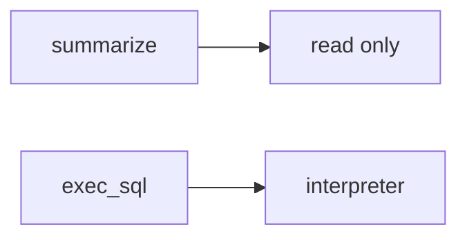

# Same idea: clinic summarizer over charts

**Kind:** transfer-challenge
**Loop step:** 7 Transfer

## Use it somewhere new

The notes-app scaffolding goes away. You get a **clinic summarizer over charts**. Your job is to rewrite the loop, not to name a bug-list code.

The notes-app sentence was: `run_tool("exec_sql", {})` must be None. Rewrite it for a clinic without changing the fork: `exec_sql` denied, `search_notes` may run. A system prompt is still English, not permission.

**Product sketch:** an EHR-lite "the model is only allowed to summarize, the system prompt forbids SQL," plus "we mapped a famous-bugs list so the agent is done."

## Picture: same tool loop, clinical object

Renaming "note" to "chart" is not transfer. Rule, allow-list, and leftover change. Telling the model to summarize does not take `exec_sql` out of always-run `run_tool`.

| Notes app this week | Clinic sketch |
|---|---|
| Agent must not run `exec_sql` | Clinic summarizer must not run chart-SQL |
| `run_tool("exec_sql", {})` is None | Same call — `exec_sql` still denied |
| Allow-listed `search_notes` may run | Same allow-list — local practice files only |
| Prompt injection / poisoned retrieval | Same actors — **not** a live clinic model |
| System prompt / retrieval / famous-bugs map | Same inputs — not the tool decision |

If the model "only summarizes" while `run_tool` is always-run, the rule is gone. A system prompt, retrieval, and a famous-bugs mapping do not put `exec_sql` outside `ALLOWED`. A coding assistant in CI that can install packages is the same allow-list grain — name it, do not jailbreak a live model here. Guidance documents on AI risk are not this check. Cryptographically bound approvals are extra, advanced work, not this week's check.

The clinic rewrite still has to keep the notes-app fork: `exec_sql` denied, `search_notes` may run. Adding a prompt without an allow-list leaves `run_tool("exec_sql")` running. The local pytest analogue is `test_exec_sql_tool_is_denied` — on a practice, not a live model.

## Prompt — clinic summarizer over charts

Rewrite the notes-app sentence. Include:

1. who can act (prompt injection in a chart note — not a live clinic model);
2. what you trust (runtime allow-list is the promise; prompt, retrieval, and a famous-bugs map are not);
3. what must not happen (`run_tool("exec_sql")` runs, not a legal label);
4. a test idea on a **local** practice files only (no live vendor API);
5. leftover (HTML from `search_notes`, hallucinated packages, cryptographically bound approvals);
6. whether operators read the denial (say `exec_sql` not allow-listed, not color only). If an approval screen exists, operators must not auto-approve.

Use fake labels. Do not use real patient names.

Also name a coding assistant in CI.

## What is not good enough

| Reject | Why |
|---|---|
| "the prompt forbids SQL" | Not mediation |
| Live model / jailbreak tutorial | Course rules |
| "famous-bugs map so mediation is done" | Awareness after the cause |
| "we use retrieval" | Retrieval is still untrusted |
| "assurance gate complete" | Forbidden stamp |

## Practice

One page. No answer keys. `labs/E1/e1-lab` is the only running system you may break. Do not call a live model.

## What this page is not doing

Live-model attacks. Public prompt-injection walkthroughs. Claiming you finished an assurance gate from this page.
