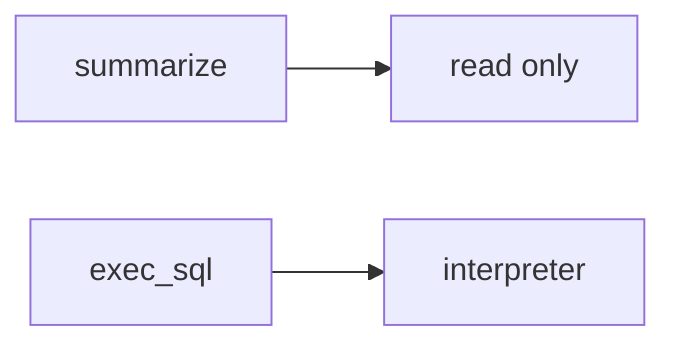

# Same idea on a clinic summarizer over charts

**Kind:** transfer-challenge
**Loop step:** 7 Transfer

## Use it somewhere new

You get a **clinic summarizer over charts**.

`run_tool("exec_sql", {})` must be None. For a clinic, `exec_sql` still has to be denied. `search_notes` may still run. A system prompt is still English, not permission.

An EHR-lite "the model is only allowed to summarize, the system prompt forbids SQL," plus "we mapped a famous-bugs list so the agent is done."

## Picture: same tool loop, clinical object

Here, a clinic chart is still this topic’s note. Name the rule, the allow-list, and what still changes after the prompt is “safe.” Telling the model to summarize does not take `exec_sql` out of always-run `run_tool`.

| Notes app | Clinic sketch |
|---|---|
| Agent must not run `exec_sql` | Clinic summarizer must not run chart-SQL |
| `run_tool("exec_sql", {})` is None | Same call — `exec_sql` still denied |
| Allow-listed `search_notes` may run | Same allow-list — local practice files only |
| Prompt injection / poisoned retrieval | Same actors — **not** a live clinic model |
| System prompt / retrieval / famous-bugs map | Same inputs — not the tool decision |

If the model "only summarizes" while `run_tool` is always-run, the rule is gone. A system prompt, retrieval, and a famous-bugs mapping do not put `exec_sql` outside `ALLOWED`. A coding assistant in CI that can install packages is the same allow-list grain — name it, do not jailbreak a live model here. Guidance documents on AI risk are not this check. Cryptographically bound approvals are extra, advanced work, not this check.

`exec_sql` denied, `search_notes` may run. Adding a prompt without an allow-list leaves `run_tool("exec_sql")` running. The local check is `test_exec_sql_tool_is_denied` — on a practice, not a live model.

## Write this for a clinic summarizer over charts

1. who might try (prompt injection in a chart note — not a live clinic model);
2. what you trust (runtime allow-list is the promise; prompt, retrieval, and a famous-bugs map are not);
3. what must not happen (`run_tool("exec_sql")` runs);
4. a check on **local** practice files only (no live vendor API);
5. leftover (HTML from `search_notes`, hallucinated packages, cryptographically bound approvals);
6. whether operators read the denial (say `exec_sql` not allow-listed, not color only). If an approval screen exists, operators must not auto-approve.

Use fake labels. Do not use real patient names.

Also name a coding assistant in CI.

## What is not good enough

| Reject | Why |
|---|---|
| "the prompt forbids SQL" | Not mediation |
| Live model / jailbreak tutorial | Course rules |
| "famous-bugs map so mediation is done" | Awareness after the cause |
| "we use retrieval" | Retrieval is still untrusted |
| "assurance gate complete" | Forbidden stamp |

## Practice

Write one page. Leave the answer keys closed. `labs/E1/e1-lab` is the only running system you may break. Do not call a live model.

## What this page is not doing

Do not run live-model attacks. Do not follow public prompt-injection walkthroughs. This page does not finish an assurance gate.
