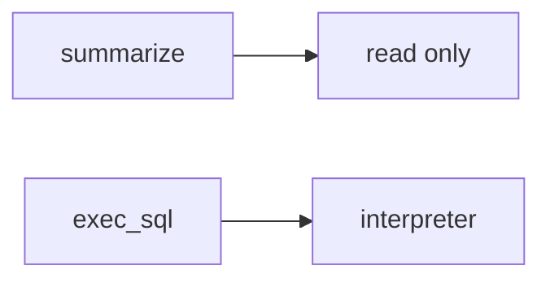

# E1-LO-07 — Transfer: clinic summarizer over charts

**Kind:** transfer-challenge
**Loop step:** 7 Transfer
**Standards:** AISVS `v1.0-C9.5.3`. LLM Top 10 2026 LLM03 awareness after the cause. `v1.0-C9.2.8` Level 3 **advanced**. NIST AI 600-1 is guidance, not the oracle.

## Change the workplace; keep the model from meaning policy

Do not answer with a Top 10 / CWE / scanner as the definition of security. The SecureCollab sentence was: `run_tool("exec_sql", {})` must be None. Rewrite it for a clinic without changing the fork.

**Prompt:** Clinic summarizer over charts. Also name Copilot in CI.

**Product sketch:** EHR-lite “the model is only allowed to summarize, the system prompt forbids SQL,” plus “we mapped LLM03 so the agent is done.”

Rewrite the SecureCollab sentence. Include:

1. attacker capabilities (prompt injection in a chart note — not a live clinic LLM attack);
2. trust assumptions (runtime allowlist is TCB; prompt/RAG/LLM03 are not);
3. forbidden outcome (`run_tool("exec_sql")` runs, not “HIPAA”);
4. a test idea on a **local** fixture only (no live OpenAI);
5. residual (HTML from search_notes, hallucinated packages, `v1.0-C9.2.8` Level 3);
6. WCAG if approval UI exists (operators must not auto-approve).

## Mental model: summarize vs execute

If the model “only summarizes” while `run_tool` is always-run, the cell is gone. A system prompt, RAG, and an LLM03 mapping do not put `exec_sql` outside `ALLOWED`. Copilot in CI that can install packages is the same allowlist grain — name it, do not jailbreak a live model here. AISVS is not ASVS. LLM03 is a regression label *after* the confused-deputy cause, not the syllabus. `v1.0-C9.2.8` is Level 3 advanced: bound approvals, not this pytest.

The clinic rewrite still has to keep the SecureCollab fork: exec_sql denied, search_notes may run. Adding a prompt without an allowlist leaves `run_tool("exec_sql")` running. The local pytest analogue is `test_exec_sql_tool_is_denied` — on a fixture, not a live LLM.

## What graders reject

| Reject | Why |
|---|---|
| “the prompt forbids SQL” | Not mediation |
| Live LLM / jailbreak tutorial | Lab policy |
| “LLM03 so 1.2 is done” | Awareness after the cause |
| “we use RAG” | Retrieval is still untrusted |
| “Gate 7 complete” | Forbidden stamp |

## Practice

One page. No keys. `labs/E1/e1-lab` is the only running system you may break. Do not call a live model.

## Non-goals

Live-LLM attacks. Public prompt-injection walkthroughs. Claiming Gate 7 or M2 from this page.
