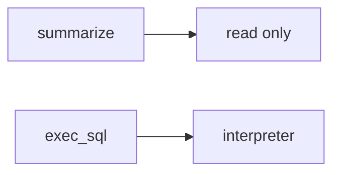

# E1-LO-07 — Transfer: clinic summarizer over charts

**Kind:** transfer-challenge
**Loop step:** 7 Transfer
**Standards:** AISVS `v1.0-C9.5.3`. LLM Top 10 2026 LLM03 awareness after the cause.

## Change the workplace; keep the model from meaning policy

Do not answer with a Top 10 / CWE / scanner as the definition of security.

**Prompt:** Clinic summarizer over charts. Also name Copilot in CI.

**Product sketch:** EHR-lite “the model is only allowed to summarize, the system prompt forbids SQL,” plus “we mapped LLM03 so the agent is done.”

Rewrite the SecureCollab sentence. Include:

1. attacker capabilities (prompt injection in a chart note — not a live clinic LLM attack);
2. trust assumptions (runtime allowlist is TCB; prompt/RAG/LLM03 are not);
3. forbidden outcome (`run_tool("exec_sql")` runs, not “HIPAA”);
4. a test idea on a **local** fixture only (no live OpenAI);
5. residual (HTML from search_notes, hallucinated packages, `v1.0-C9.2.8` Level 3);
6. WCAG if approval UI exists (operators must not auto-approve).

## Mental model: summarize vs execute

## What graders reject

| Reject | Why |
|---|---|
| “the prompt forbids SQL” | Not mediation |
| Live LLM / jailbreak tutorial | Lab policy |
| “LLM03 so 1.2 is done” | Awareness after the cause |

## Practice

One page. No keys. `labs/E1/e1-lab` is the only running system you may break.
