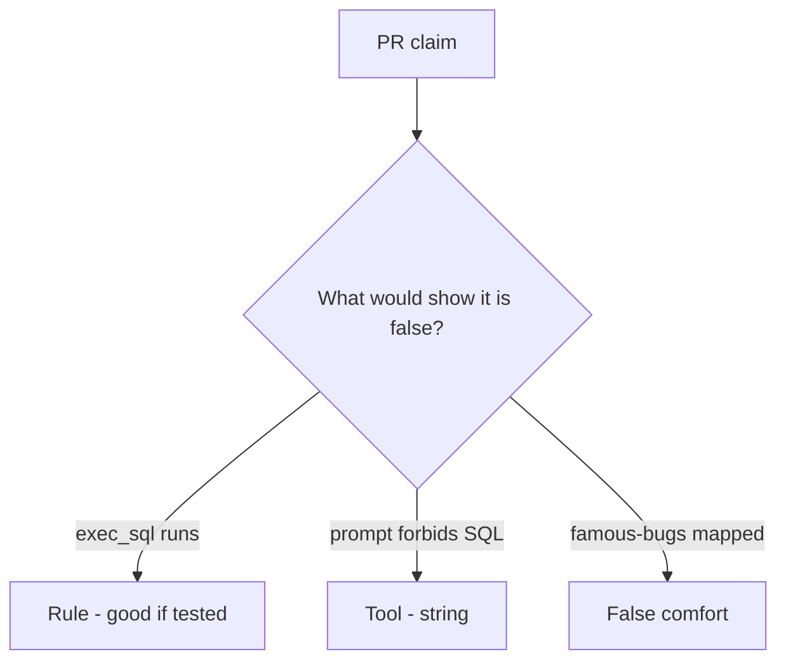

# Review always-run run_tool like a pull request

**Kind:** code-review
**Loop step:** Review

Intended findings live only in the answer-key folder — not here. Do not open that file until your review has been evaluated.

## What you are reviewing

A colleague ships the notes app's summarizer agent. Review `labs/E1/e1-lab/vulnerable/` as that change. Your job is not to count suspicious lines. Reconstruct whether `run_tool("exec_sql", {})` still runs, compare that with the rule, and write changes a developer can verify.

Start at `run_tool` and the `exec_sql` row, not at a scanner color or a famous-bugs screenshot. The check you already ran (`test_exec_sql_tool_is_denied`) is the rule test. A comment "will allow-list later" is not.

## Picture: exec_sql available

Start with this seeded smell: **`exec_sql` available**. Label it rule, tool, or false comfort before you accept the change.

Start from what must stay true (`exec_sql` is None). Everything that is not allow-list membership at that call is a candidate always-run path. A prompt screenshot without that check is the same problem, not a different kind of finding.

Retrieved docs are untrusted. Coding-assistant install tools are a later leftover. Name them, do not skip `test_exec_sql_tool_is_denied`. This page does not mark you as finished. Do not call a live model to prove the finding.

## Seeded smells (label them yourself)

- `exec_sql` available
- Policy only in the system prompt
- No denied-tool test
- Retrieved docs trusted

Also reject: live model attacks; shipping without re-running `test_exec_sql_tool_is_denied`; keys in learner notes; claiming an assurance gate.

## Common mix-ups

- A famous-bugs list is the rulebook for AI
- Retrieval is safe because it is "our data"
- The model is what you trust
- A system prompt is complete mediation
- A famous-bugs mapping is `run_tool`

## Practice

Write three review notes a maintainer could act on. Each note: what you saw, rule or false comfort, suggested structural change, leftover you will **not** delete. Tie at least one note to `test_exec_sql_tool_is_denied`. Do not open the keys file.

## Use it somewhere new

Clinic change that "added a system prompt and a famous-bugs mapping" without an allow-list is an incomplete tool-gate review. Name the independent falsehood that would still keep `exec_sql` from running.

## Can people still use it

A denied tool must say why it stayed out (`exec_sql` not allow-listed), not only "will allow-list later."

## What this page is not doing

Do not merge by adding a comment "will allow-list later." That comment is leftover without an owner. Do not jailbreak a public model to prove the finding.
