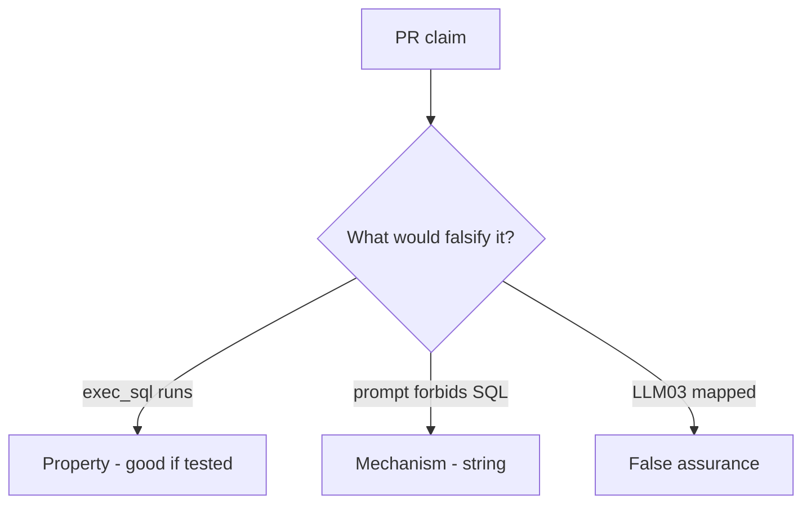

# E1-LO-08 — Review always-run run_tool as a PR

**Kind:** code-review
**Loop step:** Review
**Standards:** AISVS `v1.0-C9.5.3`. ASVS `v5.0.0-8.2.1`.

## Review the fixture as if it were SecureCollab’s summarizer agent

Review `labs/E1/e1-lab/vulnerable/` as a SecureCollab PR. Intended findings live only in `content/assessment/keys/E1.md` — not here.

## Mental model: exec_sql available

Start with this seeded smell: **`exec_sql` available**. Label it property, mechanism, or false assurance before you accept the PR.

Seeded smells (label them yourself; do not open the keys file):

- `exec_sql` available
- Policy only in the system prompt
- No denied-tool test
- Retrieved docs trusted

Also reject: live LLM attacks, keys in lessons, claiming Gate 7.

## Misconceptions

- LLM Top 10 is ASVS for AI
- RAG is safe because it is “our data”
- The model is in the TCB

## Practice

Write three review notes. Tie at least one to `test_exec_sql_tool_is_denied`.

## Transfer

Clinic PR that “added a system prompt and LLM03 mapping” without an allowlist is incomplete.
