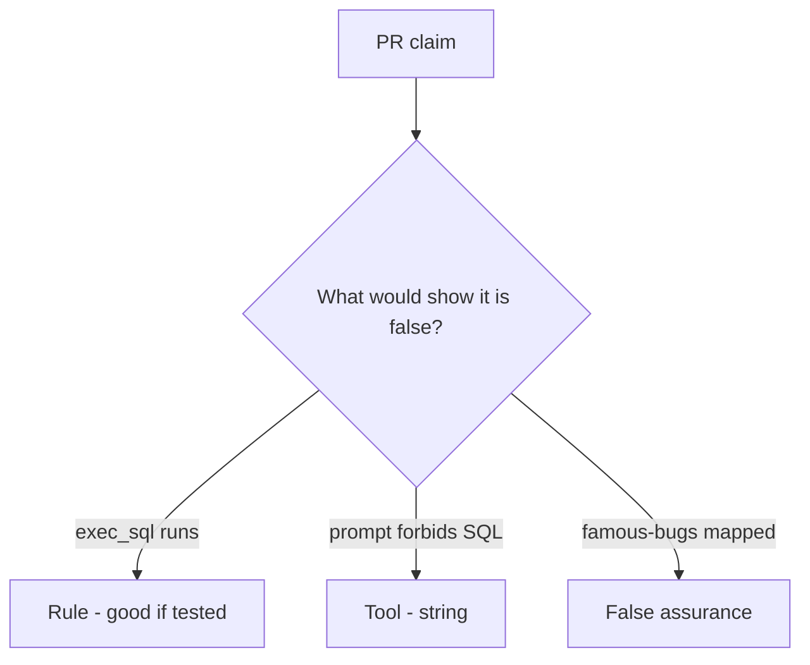

# Would you merge this always-run run_tool?

**Kind:** code-review
**Loop step:** Review

## What you are reviewing

Review `labs/E1/e1-lab/vulnerable/` as a change to the notes app's summarizer agent. Check whether `run_tool("exec_sql", {})` still runs.

Start at `run_tool` and the `exec_sql` row, not at a scanner color or a famous-bugs screenshot. A comment "will allow-list later" is not a pass on `test_exec_sql_tool_is_denied`.

## Picture: exec_sql available

**`exec_sql` available**.

`exec_sql` is still None. If the change never checks allow-list membership, that always-run leftover is still open. A prompt screenshot does not replace that check.

Retrieved docs are untrusted. Coding-assistant install tools are a later leftover. Name them, do not skip `test_exec_sql_tool_is_denied`. This page does not mark you as finished. Do not call a live model to prove the finding.

## Problems to find (name them yourself)

- `exec_sql` available
- Policy only in the system prompt
- No denied-tool test
- Retrieved docs trusted

Also reject: live model attacks; shipping without re-running `test_exec_sql_tool_is_denied`; keys in learner notes; claiming an assurance gate.

## Common mix-ups

- A famous-bugs list is the rulebook for AI
- Retrieval is safe because it is "our data"
- The model is what you trust
- A system prompt is complete mediation
- A famous-bugs mapping is `run_tool`

## Use it somewhere new

Clinic change that "added a system prompt and a famous-bugs mapping" without an allow-list is an incomplete tool-gate review. Name the independent falsehood that would still keep `exec_sql` from running.

## Can people still use it

A denied tool must say why it stayed out (`exec_sql` not allow-listed), not only "will allow-list later."

## What this page is not doing

Do not merge by adding a comment "will allow-list later." That comment is leftover without an owner. Do not jailbreak a public model to prove the finding.
