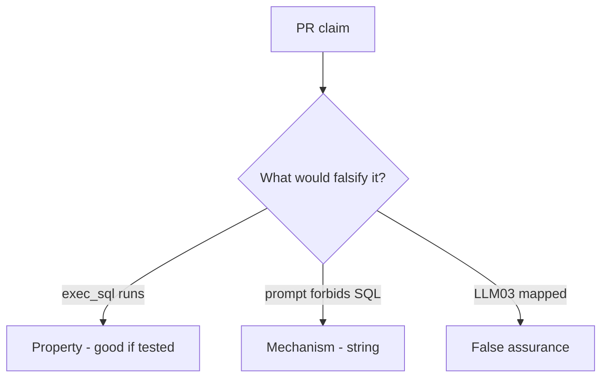

# E1-LO-08 — Review always-run run_tool as a PR

**Kind:** code-review
**Loop step:** Review
**Standards:** AISVS `v1.0-C9.5.3`. ASVS `v5.0.0-8.2.1`. LLM03 awareness after the cause.

## Review the fixture as if it were SecureCollab’s summarizer agent

Review `labs/E1/e1-lab/vulnerable/` as a SecureCollab PR. Your job is not to count suspicious lines. Reconstruct whether `run_tool("exec_sql", {})` still runs, compare that with the module invariant, and write changes a developer can verify.

Intended findings live only in `content/assessment/keys/E1.md` — not here. Do not open the keys file until your review has been evaluated.

## Mental model: exec_sql available

Start with this seeded smell: **`exec_sql` available**. Label it property, mechanism, or false assurance before you accept the PR.

Classification starts at the protected effect (exec_sql is None). Everything that is not allowlist membership at that call is a candidate always-run path. A prompt screenshot without that pytest is the same smell, not a different finding class.

Retrieved docs are untrusted. Copilot install-tools are 10.2. Do not skip `test_exec_sql_tool_is_denied`. Do not claim Gate 7. Do not call a live model to prove the finding.

## Seeded smells (label them yourself)

- `exec_sql` available
- Policy only in the system prompt
- No denied-tool test
- Retrieved docs trusted

Also reject: live LLM attacks; shipping without re-running `test_exec_sql_tool_is_denied`; keys in lessons; claiming Gate 7; treating AISVS as ASVS.

## Misconceptions this module refuses

- LLM Top 10 is ASVS for AI
- RAG is safe because it is “our data”
- The model is in the TCB
- A system prompt is complete mediation
- LLM03 mapping is `run_tool`

## Practice

Write three review notes a maintainer could act on. Each note: observation, property or false assurance, suggested structural change, residual you will **not** delete. Tie at least one to `test_exec_sql_tool_is_denied`.

## Transfer

Clinic PR that “added a system prompt and LLM03 mapping” without an allowlist is an incomplete tool-gate review. Name the independent falsehood that would still keep exec_sql from running.

## Non-goals

Do not merge by adding a comment “will allowlist later.” That comment is a residual without an owner. Do not jailbreak a public model to prove the finding.
