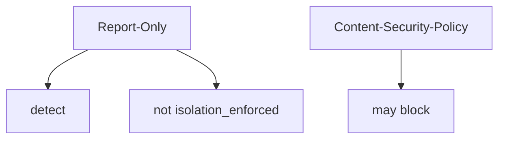
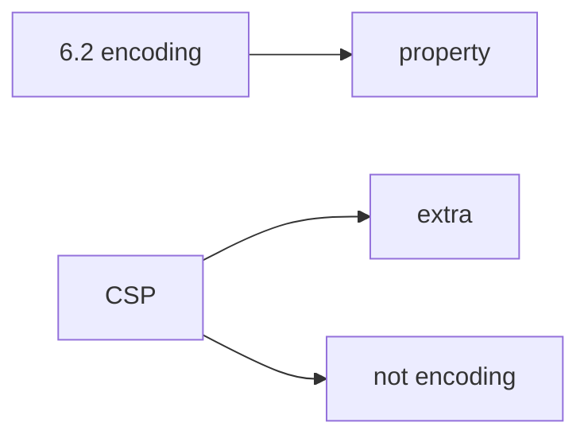

# Report-Only is not enforcement

**Kind:** concept-model
**Loop step:** 1 Property

## The rule

The notes app this week may send a content-security policy on its Next.js responses. **Isolation of script execution** is whether the *enforcing* header is present. `Content-Security-Policy-Report-Only` is a signal. It is not that check.

> `isolation_enforced({"Content-Security-Policy-Report-Only": "default-src 'none'"})` must be false. An enforcing `Content-Security-Policy` header may make it true.

What must not happen is **Report-Only treated as isolation**. A script still runs. The dashboard looks green.

Industry lists ask for a content-security policy as a **layer** after encoding (6.2). Reporting from that policy is extra, later, and advanced — reporting is the Report-Only kind of signal, not enforcement. The current content-security spec and Trusted Types are still **draft**.

## Picture: two header names



## Picture: a content-security policy is a layer



**A tool is not the rule.** Helmet defaults, a green reporting dashboard, or “we set a header.”

## Why it happens, what it costs, how you stop it, how you notice, how you recover

| Slice | For this rule |
|---|---|
| Why it happens | Report-Only mistaken for on |
| What has to be true first | Report-Only counted as enforced |
| Trigger | A script that would only be logged |
| What it costs | Integrity of the browser policy |
| How you stop it | Require the enforcing header; do not claim isolation otherwise |
| How you notice | `csp_report_only_not_enforced` |
| How you recover | Flip to enforcing after encoding (6.2) |

## What the framework does vs what you still have to check

Some templates ship Report-Only. A CDN can strip the enforcing header (2.2).

What this practice is supposed to show: on **these** practice headers, Report-Only alone is not isolation. The practice folder is `labs/E2/e2-lab`. It is local only. It is not a live page and not a public site.

## What the tool cannot do

- A content-security policy does not replace encoding (6.2) or CSRF (6.3).
- JSONP leftovers, Trusted Types not deployed, and XS-Leaks stay named leftovers.

## Can people still use it

A content-security violation report is not a person-facing error. If you show a blocked-script message, use text, not color-only meaning (the web accessibility baseline).

## Practice

Classify each header as enforce vs signal. Then run the local pair:

```text
python3 -m pytest labs/E2/e2-lab/tests --impl vulnerable
python3 -m pytest labs/E2/e2-lab/tests --impl fixed
```

The first command must fail. The second must pass.

## Use it somewhere new

Trusted Types. COOP/COEP. Clinic: Report-Only as a “HIPAA header.”

## What this page is not doing

Live script hunts, claiming check-in 7. Answer keys are not on this site.
