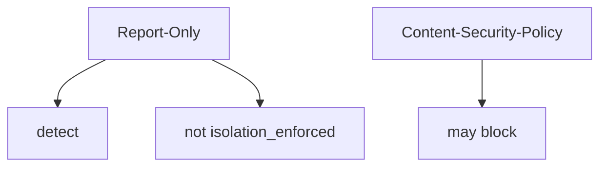
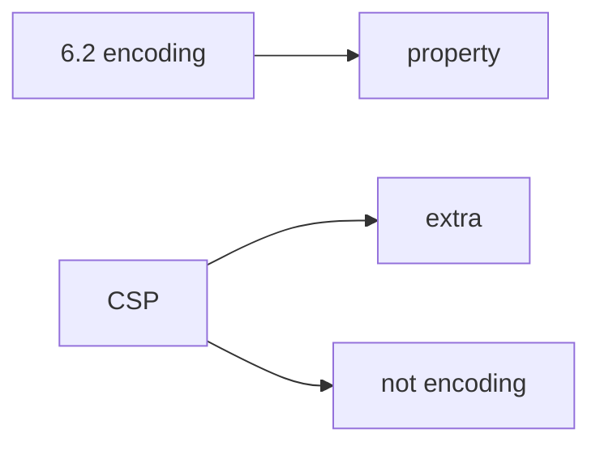

# E2-LO-01 — Report-Only is not enforcement

**Kind:** concept-model
**Loop step:** 1 Property
**Standards:** ASVS `v5.0.0-3.4.3`; `v5.0.0-3.4.7` is **Level 3, advanced**. W3C CSP3 and Trusted Types are **Working Draft**.

## The claim this module owns

SecureCollab’s Next.js responses may send CSP. **Isolation of script execution** is whether the *enforcing* header is present. `Content-Security-Policy-Report-Only` is a signal. It is not that check.

> `isolation_enforced({"Content-Security-Policy-Report-Only": "default-src 'none'"})` must be false. An enforcing `Content-Security-Policy` header may make it true.

The forbidden outcome is **Report-Only treated as isolation**. XSS still runs; the dashboard looks green.

ASVS `v5.0.0-3.4.3` wants a CSP as a **layer** after encoding (6.2). `v5.0.0-3.4.7` (CSP reporting) is **Level 3, advanced** — reporting is the Report-Only grain, not enforcement. CSP3 remains **draft**.

## Mental model: two header names



## Mental model: CSP is a layer



**Mechanism (not the property):** Helmet defaults, a green reporting dashboard, “we set a header.”

## Root cause vs impact vs prevention vs detection vs recovery

| Slice | For this property |
|---|---|
| Root cause | Report-Only mistaken for on |
| Preconditions | Report-Only ⇒ enforced true |
| Trigger | XSS that would only be logged |
| Impact | Integrity of the browser policy mechanism |
| Prevention | Detect enforcing header; do not claim isolation otherwise |
| Detection | `csp_report_only_not_enforced` |
| Recovery | Flip to enforcing after 6.2 |

## Framework defaults versus the header guarantee

Some templates ship Report-Only. A CDN can strip the enforcing header (2.2).

## Mechanism limits

- CSP does not replace encoding (6.2) or CSRF (6.3).
- JSONP; Trusted Types not deployed; XS-Leaks.

## Usability and accessibility

A CSP violation report is not a user-facing error. If you show a blocked-script message, use text not color-only (WCAG 2.2).

## Practice

Classify each header as enforce vs signal. Then run:

```
python3 -m pytest labs/E2/e2-lab/tests --impl vulnerable
python3 -m pytest labs/E2/e2-lab/tests --impl fixed
```

The first command must fail. The second must pass.

## Transfer

Trusted Types, COOP/COEP. Clinic: Report-Only as “HIPAA header.”

## Non-goals

Live XSS, claiming Gate 7. Answer keys are not in this file.
