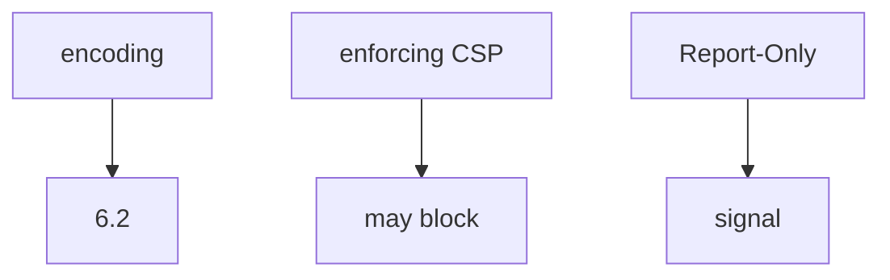
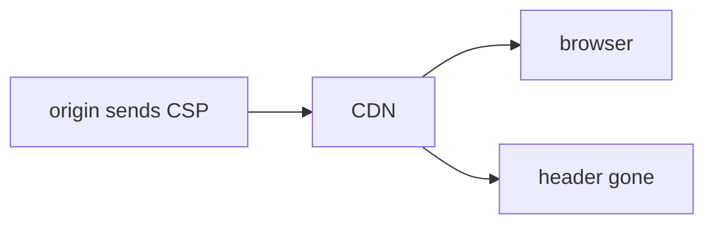

# E2-LO-02 — Enforce vs signal vs encoding

**Kind:** design-exercise
**Loop step:** 2 Model
**Standards:** ASVS `v5.0.0-3.4.3`, `v5.0.0-3.4.7`. CSP3 **draft**.

## Can a second engineer name the enforcement check from your header map?

“We set CSP” is not this lesson. A reviewable model names **enforcing header vs Report-Only, encoding (6.2), and whether the edge can strip it**.

SecureCollab freeze: local `isolation_enforced(headers)`. No live origins.

## Mental model: three layers

## Mental model: edge can lie

## Step 1: freeze pieces

| Piece | This system |
|---|---|
| Subjects | XSS; dashboard reader |
| Objects | script execution |
| Actions | `isolation_enforced` |
| Channels | response headers; CDN |
| TCB | enforcing header name |
| Untrusted | Report-Only; Helmet sticker |
| State / time | deploy; cache TTL |
| 1.1 cell | integrity of browser policy |

## Step 2: write cells

| Subject | Object | Action | Decision |
|---|---|---|---|
| Report-Only | isolation | treat as on | deny |
| enforcing CSP | isolation | treat as on | may allow |
| encoding skipped | HTML | treat as CSP | deny |
| CDN strip | isolation | treat as on | deny |

## Practice

Draw the map. Point at `labs/E2/e2-lab` file `csp.py`.

## Transfer

Clinic HIPAA header: Report-Only is still a signal.

## Residual risk

XS-Leaks; Trusted Types **draft**; `v5.0.0-3.4.7` Level 3 reporting.

## Non-goals

Top 10 as the definition of security. Keys stay out of lessons.
