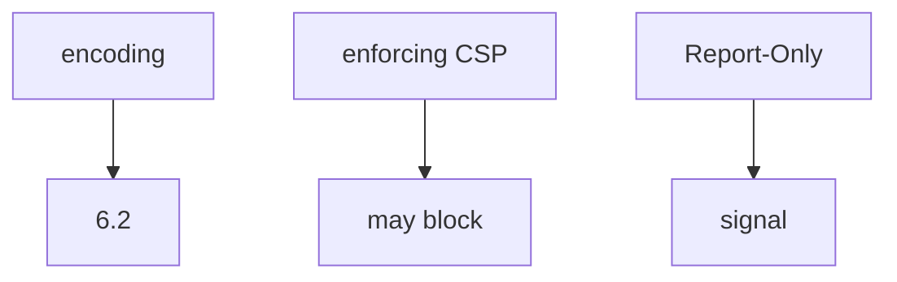
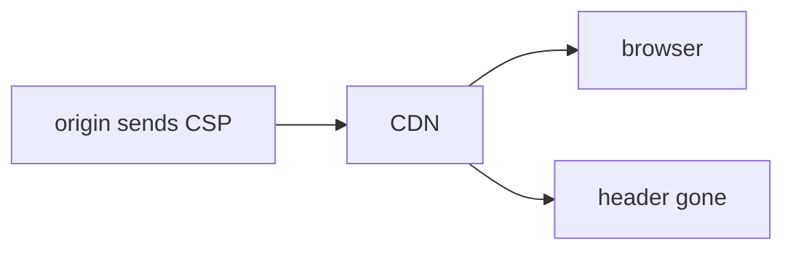

# Enforce vs signal vs encoding

**Kind:** design-exercise
**Loop step:** 2 Model

## Could someone else name the enforcement check from your header map?

“We set a content-security policy” is not this lesson. A map someone else can test names **the enforcing header vs Report-Only, encoding (6.2), and whether the edge can strip it**.

This week on the notes app: local `isolation_enforced(headers)`. No live pages.

## Picture: three layers

## Picture: the edge can lie

## Step 1: name the pieces

| Piece | This system |
|---|---|
| Who | A script that would only be logged; dashboard reader |
| What | script execution |
| Actions | `isolation_enforced` |
| Paths | response headers; CDN |
| What you trust | the enforcing header name |
| What you do not trust | Report-Only; a Helmet sticker |
| Time | deploy; cache TTL |
| Integrity rule | integrity of browser policy |

## Step 2: write the rules the check can fail

| Who | What | Action | Decision |
|---|---|---|---|
| Report-Only | isolation | treat as on | deny |
| enforcing CSP | isolation | treat as on | may allow |
| encoding skipped | HTML | treat as CSP | deny |
| CDN strip | isolation | treat as on | deny |

## Practice

Open `csp.py` in `labs/E2/e2-lab`. Label Report-Only as a signal even in the repaired files — the fix is the enforcing header name, not pretending a report became a block.

## Use it somewhere new

Clinic HIPAA header: Report-Only is still a signal.

## What can still go wrong

XS-Leaks. Trusted Types still **draft**. Reporting from a content-security policy is extra, later, and advanced — not this week’s enforcement.

## What this page is not doing

Answer keys are not on this site.
