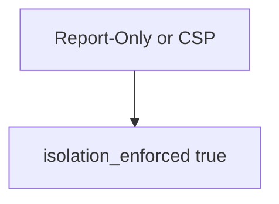

# Practice: Report-Only counted as on

**Kind:** mechanism-lab
**Loop step:** 3 Break

## Try it

The practice is not a website you attack. This is a local model of header names. `isolation_enforced` treats Report-Only as on. Report-Only counted as isolation is **a failed rule**, not an exploit recipe.

> `isolation_enforced` must be false when the only header is `Content-Security-Policy-Report-Only`. An enforcing `Content-Security-Policy` header may count.

## Where you may practice

Stay inside `labs/E2/e2-lab`. The practice files are `isolation_enforced(headers)`. Fake header dicts only. It does not open a browser. Do not load a live page, probe a public host, or scan someone else’s site as this exercise.

Do not paste this exercise onto a public site, employer board, or live clinic portal.

What must not happen: **Report-Only treated as isolation**. `isolation_enforced({"Content-Security-Policy-Report-Only": "default-src 'none'"})` returns true.

Who could do this: a script that would only be logged. That stands in for “we ship Report-Only so scripts are blocked,” a Helmet default treated as encoding (6.2), or a green reporting dashboard treated as isolation. What is supposed to stop this: `isolation_enforced` is supposed to require the **enforcing** header name. Next.js header helpers, a CDN, and FastAPI are not enough.

## Picture: any CSP-looking header counts



The broken files show **cause** (Report-Only mistaken for on). Do not probe public hosts. What has to be true first: either header name makes the function true. You do not need a browser. You must not load a live page.

Encoding is already the rule in 6.2. The check is **the header name that actually blocks**. Check-in 7 and milestone M2 stay **not finished**.

## What to read in the practice files

`vulnerable/csp.py` returns true if either header name is present. Checks:

- `test_report_only_is_not_enforcement`
- `test_enforcing_csp_header_may_count` — enforcing CSP may pass on both

You do not need a new header.
## Why it happens, what it costs, how you stop it, how you notice, how you recover

| Slice | This practice |
|---|---|
| Required rule | Report-Only only → `isolation_enforced` false |
| Why it happens | Report-Only mistaken for on |
| What has to be true first | Either header name ⇒ true |
| Trigger | A script that would only be logged |
| What it costs | A script still runs; the dashboard looks green |
| How you stop it | Count only `Content-Security-Policy` |
| How you notice | `csp_report_only_not_enforced`; never HTML |
| How you recover | Flip to enforcing after encoding (6.2) |
| Not the lesson | A Helmet product; a live script hunt; check-in 7 complete |

## What the framework does vs what you still have to check

Some templates ship Report-Only. Helmet will send whatever you configure. A CDN can strip the enforcing header (2.2). Report-Only only is false.

## Practice

Run checks against the broken files (they **must fail** on Report-Only counted as on). Record the check name `test_report_only_is_not_enforcement`.

```text
python3 -m pytest labs/E2/e2-lab/tests --impl vulnerable
```

Run from `labs/E2/e2-lab` if a repo-root collection picks up `site/`. Do not “fix” the check to pass. Do not probe public hosts. A setup error is not proof the rule holds.

## Use it somewhere new

Clinic HIPAA header: predict without leaving this directory. Do not load a live page.

## What this page is not doing

No live-page, public-host, or browser-exploit steps. Do not claim check-in 7. The current content-security spec stays labeled draft. Reporting from that policy is extra, not enforcement.
