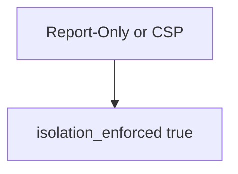

# E2-LO-03 — Observe Report-Only counted as on, do not attack live origins

**Kind:** mechanism-lab
**Loop step:** 3 Break
**Standards:** OWASP ASVS 5.0.0 (final) `v5.0.0-3.4.3`. `v5.0.0-3.4.7` CSP reporting is **Level 3, advanced**. W3C CSP3 and Trusted Types are **Working Draft**. Lab policy: local only.

## Authorized scope

`labs/E2/e2-lab` only. The fixture is an in-process `isolation_enforced(headers)`. Synthetic header dicts. Do **not** XSS, probe, or scan a public origin as the exercise.

**Forbidden outcome:** Report-Only treated as isolation enforcement. `isolation_enforced({"Content-Security-Policy-Report-Only": "default-src 'none'"})` returns true.

Attacker capability in this lab: a script that would only be logged. That stands in for “we ship Report-Only so XSS is blocked,” a Helmet default treated as 6.2, or a green reporting dashboard treated as isolation. Trust assumption: `isolation_enforced` is supposed to require the **enforcing** header name. Next.js header helpers, a CDN, and FastAPI are not in the TCB for this cell.

## Mental model: any CSP-looking header counts



The vulnerable tree demonstrates **cause** (Report-Only mistaken for on). Do not probe public hosts. Preconditions: either header name makes the function true. You do not need a browser. You must not XSS a live origin.

ASVS `v5.0.0-3.4.3` wants CSP as a **layer** after encoding (6.2). Module 6.2 already said encoding is the property; this cell is **the header name that actually blocks**. Gate 7 and M2 stay **not-attempted**.

## What to read in the fixture

`vulnerable/csp.py` returns true if either header name is present. Tests:

- `test_report_only_is_not_enforcement`
- `test_enforcing_csp_header_may_count` — enforcing CSP may pass on both

You do not need a new header. The failure of `test_report_only_is_not_enforcement` *is* the evidence.

Do not open the fixed tree yet. Diagnose the cause first.

## Root cause vs impact vs prevention vs detection vs recovery

| Slice | This lab |
|---|---|
| Required property | Report-Only only → isolation_enforced false |
| Root cause | Report-Only mistaken for on |
| Preconditions | Either header name ⇒ true |
| Trigger | XSS that would only be logged |
| Impact | Script still runs; dashboard green |
| Prevention | Count only Content-Security-Policy |
| Detection | `csp_report_only_not_enforced`; never HTML |
| Recovery | Flip to enforcing after 6.2 |
| Not the lesson | A Helmet product; live XSS; Gate 7 complete |

## Framework defaults versus the header guarantee

Some templates ship Report-Only. Helmet will send whatever you configure. A CDN can strip the enforcing header (2.2). The application guarantee is: **this** fixture, Report-Only only is false.

## Practice

```text
python3 -m pytest labs/E2/e2-lab/tests --impl vulnerable
```

Run from `labs/E2/e2-lab` if a repo-root collection picks up `site/`. Record `test_report_only_is_not_enforcement`. Do not probe public hosts. An environment error is not security evidence.

## Transfer

Clinic HIPAA header: predict without leaving this directory. Do not XSS a live origin.

## Non-goals

No live-XSS, public-origin, or browser-exploit instructions. Do not claim Gate 7. CSP3 stays labeled draft. `v5.0.0-3.4.7` is reporting, not enforcement.
