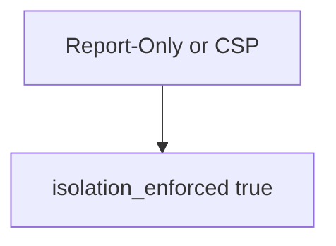

# E2-LO-03 — Observe Report-Only counted as on, do not attack live origins

**Kind:** mechanism-lab
**Loop step:** 3 Break
**Standards:** ASVS `v5.0.0-3.4.3`. Lab policy: local only.

## Authorized scope

`labs/E2/e2-lab` only. Synthetic header dicts. Do **not** XSS, probe, or scan a public origin as the exercise.

**Forbidden outcome:** Report-Only treated as isolation enforcement.

## Mental model: any CSP-looking header counts



The vulnerable tree demonstrates **cause** (Report-Only mistaken for on). Do not probe public hosts.

## What to read in the fixture

`vulnerable/csp.py` returns true if either header name is present. Tests require Report-Only to be false.

## Root cause vs impact

| Slice | Lab |
|---|---|
| Root cause | Report-Only mistaken for on |
| Impact | XSS still runs; dashboard green |
| Not the lesson | A Helmet product as the definition |

## Practice

```
python3 -m pytest labs/E2/e2-lab/tests --impl vulnerable
```

Record `test_report_only_is_not_enforcement`. Do not probe public hosts.

## Transfer

Clinic HIPAA header: predict without leaving this directory.

## Non-goals

No live-XSS, public-origin, or browser-exploit instructions.
