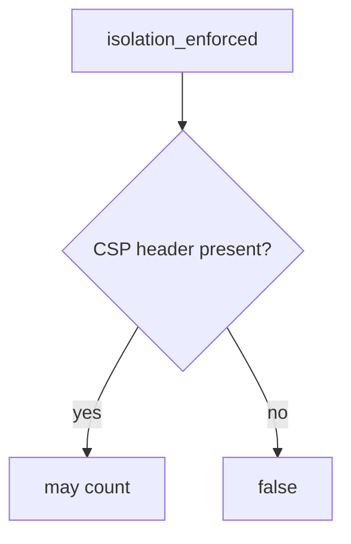

# E2-LO-04 — Require the enforcing CSP header

**Kind:** design-exercise
**Loop step:** 4 Build
**Standards:** ASVS 5.0.0 (final) `v5.0.0-3.4.3`. Reporting `v5.0.0-3.4.7` is extra, not the predicate. CSP3 **draft**.

## Structural means enforcement looks at the enforcing name

`isolation_enforced` must return true only when `Content-Security-Policy` is in the headers. Report-Only may *accompany* it; it does not replace it. Structural means that name — not Helmet, not a dashboard, not “we set a header.”

The smallest restore for SecureCollab’s Next.js responses is: Report-Only only → false, enforcing CSP may count. Do not fail open because reports are arriving. Do not treat a policy string on the wrong header as isolation.

## Mental model: name gate



Do not accept Report-Only as the name. Production still needs encoding (6.2) — a well-named header does not replace encoding. A CDN can still strip the enforcing header (2.2). Trusted Types and CSP3 remain **Working Draft**. `v5.0.0-3.4.7` (reporting) is Level 3 advanced: reports are the Report-Only grain, not this pytest.

ASVS `v5.0.0-3.4.3` wants a CSP layer. This pytest is that sentence for the header *name*.

## Why this restores the cell

| After the fix | Must be true |
|---|---|
| Report-Only only | false |
| enforcing CSP | true |

## What this is not

Encoding (6.2). Helmet. Gate 7. CSP3 **draft** as a complete catalogue. COOP/COEP. Trusted Types as encoding.

## Mechanism limits

- CSP does not replace encoding (6.2) or CSRF (6.3).
- CDN strip can drop the enforcing header after this pytest.
- XS-Leaks remain a sibling grain.
- Trusted Types is draft, not 6.2.
- `v5.0.0-3.4.7` Level 3 reporting is not enforcement.

## Practice

Name who can edit Next.js headers. Run:

```text
python3 -m pytest labs/E2/e2-lab/tests --impl fixed
```

Must pass. Run from the lab directory if collection at repo root is polluted.

## Transfer

Clinic: send enforcing CSP, keep Report-Only as a *second* header if you still want reports.

## Residual risk

CDN strip; XS-Leaks; Trusted Types **draft**; `v5.0.0-3.4.7` Level 3.

## Non-goals

Do not XSS a live origin. Do not claim Gate 7 from a reporting dashboard. Do not present CSP3 as final.
