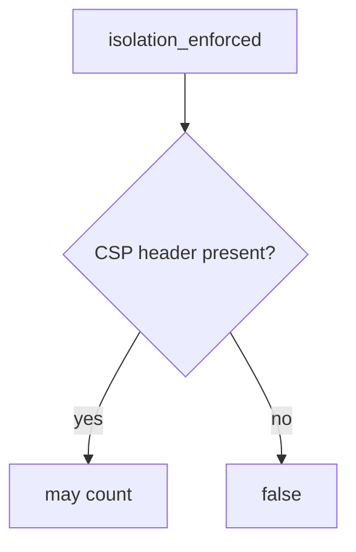

# Require the enforcing CSP header

**Kind:** design-exercise
**Loop step:** 4 Build

## The rule

A green reporting dashboard is not the fix. Helmet is not the fix. “We set a header” is not the fix.

The structural change is: `isolation_enforced` looks at the **enforcing** name. It must return true only when `Content-Security-Policy` is in the headers. Report-Only may *ride along*; it does not replace that name.

The smallest restore for the notes app’s Next.js responses is: Report-Only only → false, enforcing CSP may count. Do not fail open because reports are arriving. Do not treat a policy string on the wrong header as isolation.

## Picture: name gate



Do not accept Report-Only as the name. Production still needs encoding (6.2) — a well-named header does not replace encoding. A CDN can still strip the enforcing header (2.2). Trusted Types and the current content-security spec remain **draft**. Reporting from that policy is extra, later, and advanced: reports are the Report-Only kind of signal, not this check.

Use a content-security policy as a layer after encoding — the header *name*.

## Why this fix works

| After the fix | Must be true |
|---|---|
| Report-Only only | false |
| enforcing CSP | true |

Fail closed: if the enforcing name is missing, **do not claim isolation**. Do not keep Report-Only because “the dashboard is green.”

## What this is not

- Encoding (6.2).
- Helmet.
- Check-in 7.
- The current content-security spec as a complete list (**draft**).
- COOP/COEP.
- Trusted Types as encoding.

## What the tool cannot do

- A content-security policy does not replace encoding (6.2) or CSRF (6.3).
- A CDN strip can drop the enforcing header after this check.
- XS-Leaks remain a sibling leftover.
- Trusted Types is draft, not encoding (6.2).
- Reporting from a content-security policy is extra, later, and advanced — not enforcement.

## Practice

Name who can edit Next.js headers. Run `--impl fixed` (must pass):

```text
python3 -m pytest labs/E2/e2-lab/tests --impl fixed
```

## Use it somewhere new

A clinic example: send enforcing CSP, keep Report-Only as a *second* header if you still want reports.

## What can still go wrong

CDN strip. XS-Leaks. Trusted Types still **draft**. Reporting from a content-security policy as extra, not this check.

## What this page is not doing

Do not load a live page. Do not claim check-in 7 from a reporting dashboard. Do not present the current content-security spec as final.
