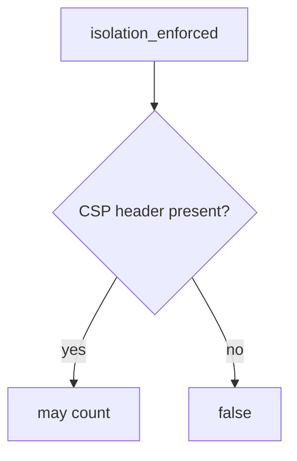

# E2-LO-04 — Require the enforcing CSP header

**Kind:** design-exercise
**Loop step:** 4 Build
**Standards:** ASVS 5.0.0 (final) `v5.0.0-3.4.3`. Reporting `v5.0.0-3.4.7` is extra, not the predicate.

## Structural means enforcement looks at the enforcing name

`isolation_enforced` must return true only when `Content-Security-Policy` is in the headers. Report-Only may *accompany* it; it does not replace it.

## Mental model: name gate



Do not accept Report-Only as the name.

## Why this restores the cell

| After the fix | Must be true |
|---|---|
| Report-Only only | false |
| enforcing CSP | true |

## What this is not

Encoding (6.2). Helmet. Gate 7. CSP3 **draft** as a complete catalogue.

## Practice

Name who can edit Next.js headers. Run:

```
python3 -m pytest labs/E2/e2-lab/tests --impl fixed
```

Must pass.

## Transfer

Clinic: send enforcing CSP, keep Report-Only as a *second* header if you still want reports.

## Residual risk

CDN strip; XS-Leaks; Trusted Types **draft**; `v5.0.0-3.4.7` Level 3.
