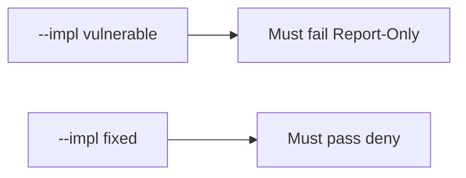

# E2-LO-05 — Evidence is Report-Only denied, then a passing pair

**Kind:** verification-lab
**Loop step:** 5 Verify
**Standards:** ASVS `v5.0.0-3.4.3`. CSP3 **draft**.

## An invariant that cannot fail a test is still a slogan

“CSP header present” is not evidence if the name is Report-Only. “Helmet is on” is a mechanism observation. The oracle is: Report-Only only is false and an enforcing `Content-Security-Policy` may count. The Report-Only observation must be **false** on `--impl vulnerable` (returns true) and **true** on `--impl fixed`. Do not XSS live origins.

## Mental model: vulnerable must fail: Report-Only

The failing observation on `--impl vulnerable` is **Report-Only**. A passing collection count is not this cell.



| Mode | Must show for this module |
|---|---|
| Negative / abuse | Report-Only → not enforced; vulnerable must fail |
| Normal | enforcing CSP → may count (may pass on both) |
| Not claimed | live XSS; Helmet; Gate 7; that encoding exists |

Lab tests in `labs/E2/e2-lab/tests/test_property.py`. `test_report_only_is_not_enforcement` is a **forbidden-outcome** test: Report-Only-as-on is not allowed to count as a passing control.

```text
python3 -m pytest labs/E2/e2-lab/tests --impl vulnerable
python3 -m pytest labs/E2/e2-lab/tests --impl fixed
```

Honest enforcing CSP may pass on both implementations. That does not excuse the Report-Only deny test. If vulnerable does not fail `test_report_only_is_not_enforcement`, the lab is miswired—fix the wiring, not the assertion.

## What the tests do not prove

- Encoding (6.2)
- Header survives the CDN (2.2)
- Trusted Types
- XS-Leaks
- `v5.0.0-3.4.7` Level 3 reporting quality
- Gate 7 / M2 complete

Record those as residuals or later modules, not as silent passes.

## Practice

Execute both implementations this session from the lab directory if needed. Write the fail/pass pair next to the matrix row. Reject a “test” that only greps `Content-Security-Policy` in HTML without calling `isolation_enforced` on a Report-Only dict.

## Transfer

Clinic: a test that only asserts “a CSP-looking header exists” is not this cell. A live origin is out of scope.

## Non-goals

Do not add a live-XSS trophy. Do not log HTML. Keys stay out of this file. Gate 7 stays not-attempted.
