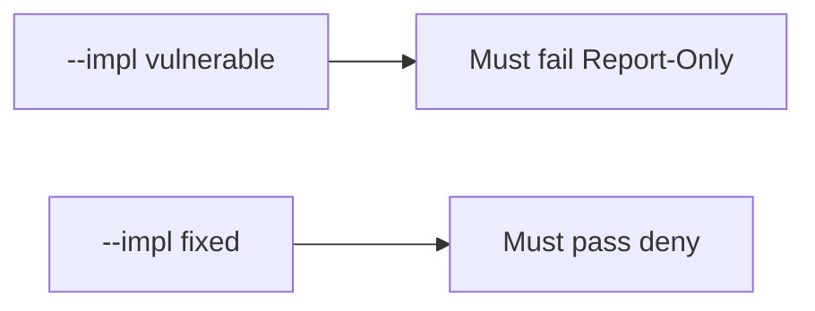

# The broken files must fail when the header is Report-Only

**Kind:** verification-lab
**Loop step:** 5 Verify

## If you cannot test it, it is still a slogan

“A content-security header is present” is not evidence if the name is Report-Only. “Helmet is on” is a tool observation. The check is: Report-Only only is false, and an enforcing `Content-Security-Policy` may count. That Report-Only observation must be **false** on `--impl vulnerable` (returns true) and **true** on `--impl fixed`. Do not load a live page.

## Picture: broken files must fail: Report-Only

A check that only counts passing cases can pass while Report-Only still counts as on. Ask whether Report-Only-as-on still counts as a passing control. The broken files must fail that. The repaired files must pass it.



If both pass, the check is not looking at Report-Only. If both fail, the fix is not structural or the check is wrong.

| Mode | Must show for this topic |
|---|---|
| Wrong input / abuse | Report-Only → not enforced; broken files must fail |
| Normal | enforcing CSP → may count (may pass on both) |
| Not claimed | a live script hunt; Helmet; check-in 7; that encoding exists |

Practice checks live in `labs/E2/e2-lab/tests/test_property.py`. `test_report_only_is_not_enforcement` is a **what-must-not-happen** check: Report-Only-as-on is not allowed to count as a passing control.

```text
python3 -m pytest labs/E2/e2-lab/tests --impl vulnerable
python3 -m pytest labs/E2/e2-lab/tests --impl fixed
```

Honest enforcing CSP may pass on both implementations. That does not excuse the Report-Only deny check. If the broken files do not fail `test_report_only_is_not_enforcement`, the practice is miswired — fix the wiring, not the check.

## What the checks do not prove

- Encoding (6.2)
- The header survives the CDN (2.2)
- Trusted Types
- XS-Leaks
- Quality of content-security reporting (extra, later, and advanced)
- Check-in 7 / milestone M2 complete

Record those as leftover risk or later topics, not as silent passes.

## Practice

Run both implementations this session from the lab directory if needed. Write the fail/pass pair next to the map-page row. Reject a “check” that only greps `Content-Security-Policy` in HTML without calling `isolation_enforced` on a Report-Only dict. A setup error is not proof the rule holds.

## Use it somewhere new

A clinic example: a check that only asserts “a CSP-looking header exists” is not this rule. A live page is out of scope.

## What this page is not doing

Do not treat a live script screenshot as proof. Do not log HTML. Answer keys are not on this site. This page does not finish check-in 7.
