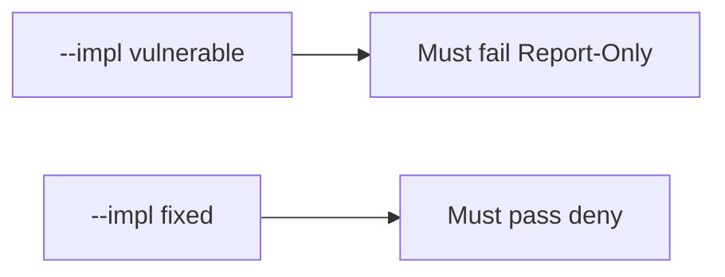

# E2-LO-05 — Evidence is Report-Only denied, then a passing pair

**Kind:** verification-lab
**Loop step:** 5 Verify
**Standards:** ASVS `v5.0.0-3.4.3`.

## An invariant that cannot fail a test is still a slogan

“CSP header present” is not evidence if the name is Report-Only. The oracle is the local pair. Do not XSS live origins.

## Mental model: fail-on-vulnerable, pass-on-fixed



| Case | Must show |
|---|---|
| Negative / abuse | Report-Only → not enforced |
| Normal | enforcing CSP → may count |
| Not claimed | live XSS; Helmet; Gate 7 |

```
python3 -m pytest labs/E2/e2-lab/tests --impl vulnerable
python3 -m pytest labs/E2/e2-lab/tests --impl fixed
```

Honest enforcing CSP may pass on both.

## What the tests do not prove

- Encoding (6.2)
- Header survives the CDN
- Trusted Types
- XS-Leaks

## Practice

Execute both implementations. Map each test to an LO-02 cell.

## Transfer

Clinic: a test that only asserts “a CSP-looking header exists” is not this cell.
