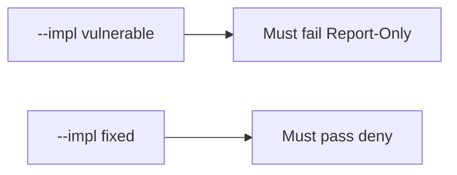

# The broken files must fail when the header is Report-Only

**Kind:** verification-lab
**Loop step:** 5 Verify

## Check it

A Report-Only content-security header does not enforce the policy. A Helmet import is a library. Report-Only only has to be false, and an enforcing `Content-Security-Policy` may count. Broken: Report-Only still returns true. Repair makes Report-Only false. Do not load a live page.

## Picture: broken files must fail: Report-Only

Report-Only can still count as on under a green suite.



If the broken header check still passes, Report-Only was never treated as off.

| Mode | Must show for this topic |
|---|---|
| Wrong input / abuse | Report-Only → not enforced; broken files must fail |
| Normal | enforcing CSP → may count (may pass on both) |
| Not claimed | a live script hunt; Helmet; check-in 7; that encoding exists |

The checks are in `labs/E2/e2-lab/tests/test_property.py`. `test_report_only_is_not_enforcement` is there so Report-Only-as-on still fails.

```text
python3 -m pytest labs/E2/e2-lab/tests --impl vulnerable
python3 -m pytest labs/E2/e2-lab/tests --impl fixed
```

An enforcing content-security policy may pass on both sides. You still have to deny Report-Only treated as on. If the broken files do not fail `test_report_only_is_not_enforcement`, the practice is miswired — fix the wiring, not the check.

## What the checks do not prove

- Encoding (6.2)
- The header survives the CDN (2.2)
- Trusted Types
- XS-Leaks
- Quality of content-security reporting (extra, later, and advanced)
- Check-in 7 / milestone M2 complete

## Practice

Call `isolation_enforced` on a Report-Only dict. A `Content-Security-Policy` name in HTML can still be Report-Only. A setup error is not proof the rule holds.

## Use it somewhere new

A CSP-looking header can still be Report-Only. Do not use a live page.

## What this page is not doing

A live script screenshot is not an enforcing policy. Do not log HTML. Answer keys are not on this site. This page does not finish check-in 7.
