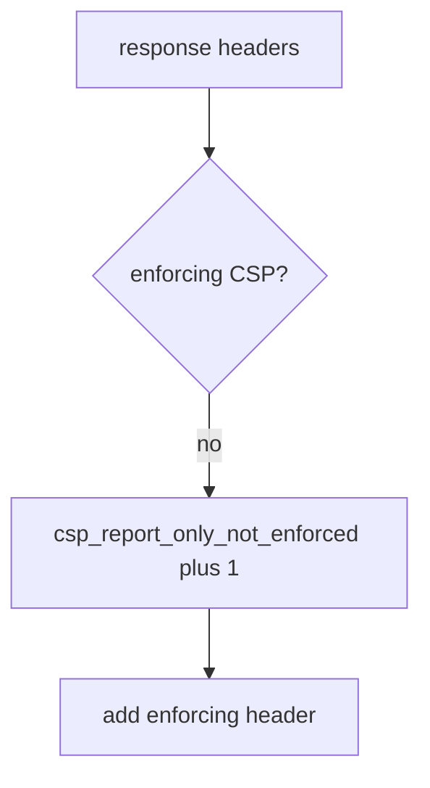

# E2-LO-06 — Detect csp_report_only_not_enforced without logging HTML

**Kind:** operations-exercise
**Loop step:** 6 Operate
**Standards:** NIST CSF 2.0 (final) DE/RS/RC as outcome labels; ASVS `v5.0.0-3.4.7` labeled **Level 3, advanced** as reporting, not close.

## Prevention is not absolute

A CDN can strip the enforcing header after deploy. Pair detect and recover. Do not log full HTML or note bodies (3.1). Do not paste the page source into the ticket.

## Mental model: Report-Only-only is a signal



| Outcome | This module |
|---|---|
| Detect | `csp_report_only_not_enforced` |
| Signal | header names present; never HTML bodies |
| Recover | Flip to enforcing after 6.2 |
| Residual | XS-Leaks; cache strip; Trusted Types draft |

CSF 2.0 Detect / Respond / Recover name outcomes. They do not prove `v5.0.0-3.4.3`. A Helmet-product name is not the property. Re-run `test_report_only_is_not_enforcement` after any header-middleware change; a green reporting dashboard is not that pytest. Encoding (6.2) still has to exist before you claim Recover — CSP is a layer.

## Framework defaults versus the operate guarantee

A CSP reporting dashboard will show violation counts and stay silent when CI’s `isolation_enforced` treats Report-Only as on. Detection must observe **Report-Only is not enforcement**, not report volume. If the alert includes HTML, you have opened a 3.1 cell. `v5.0.0-3.4.7` names reporting as Level 3 advanced — reports are not close.

## Practice

Write one log line you would accept. Tie it to `labs/E2/e2-lab`.

```text
log_denied reason=csp_report_only_not_enforced route=/app
```

Reject any line that includes HTML, a note body, or “Gate 7 complete.”

## Transfer

Clinic: deny the HIPAA-header claim; do not paste the page source into the ticket. Do not XSS a live origin.

## Usability

A blocked-script message (once enforcing) must be readable without color-only meaning (WCAG 2.2 Success Criterion 4.1.3).

Cause vs impact stays split here too: the **cause** is Report-Only mistaken for on; the **impact** is a script that still runs; **prevention** is the enforcing name; **detection** is `csp_report_only_not_enforced`; **recovery** is flip-after-6.2. Mechanism limit: this alert does not prove encoding exists and does not survive a CDN strip.

## Non-goals

A Helmet-vendor name is not the property. M2 stays not-attempted. CSP3 stays draft.
