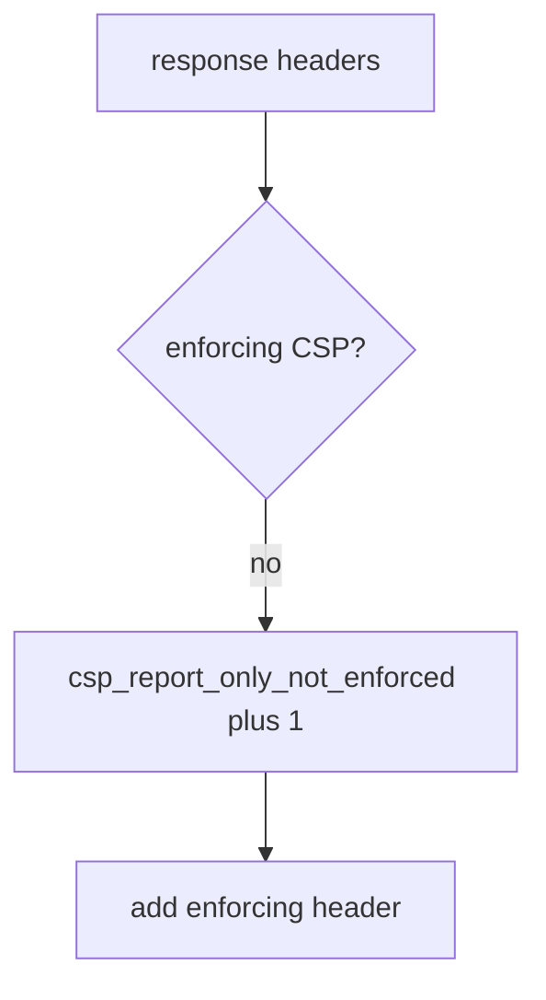

# Log that Report-Only is not enforcement, not the HTML

**Kind:** operations-exercise
**Loop step:** 6 Operate

## Stopping it is not enough

A CDN can strip the enforcing header after deploy. Pair notice and recover. Do not log full HTML or note bodies (3.1). Do not paste the page source into the ticket.

## Picture: Report-Only-only is a signal



Noticing, responding, and recovering still need an owner. They do not prove the enforcing header is present.

## Signals that do not become a second leak

| Outcome | This topic |
|---|---|
| Notice | `csp_report_only_not_enforced` |
| What the line holds | header names present; never HTML bodies |
| Recover | Flip to enforcing after encoding (6.2) |
| Leftover | XS-Leaks; cache strip; Trusted Types draft |

A vendor name is not this week's rule. Re-run `test_report_only_is_not_enforcement` after any header-middleware change; a green reporting dashboard is not that check. Encoding (6.2) still has to exist before you claim Recover — a content-security policy is a layer.

## What the framework does vs what you still have to check

A content-security reporting dashboard will show violation counts and stay silent when CI’s `isolation_enforced` treats Report-Only as on. Notice must observe **Report-Only is not enforcement**, not report volume. If the alert includes HTML, you have opened a logging leak (3.1). Reporting from a content-security policy is extra, later, and advanced — reports are not close.

What this practice is supposed to show: `csp_report_only_not_enforced` fires without HTML, and a reporting dashboard is extra, not this week’s enforcement.

## Practice

Write one log line you would accept in review. Tie it to `labs/E2/e2-lab`. Example shape (fake routes only):

```text
log_denied reason=csp_report_only_not_enforced route=/app
```

Reject any line that includes HTML, a note body, or “check-in 7 complete.”

## Use it somewhere new

A clinic example: deny the HIPAA-header claim; do not paste the page source into the ticket. Do not load a live page.

## Can people still use it

A blocked-script message (once enforcing) must be readable without color-only meaning (the web accessibility baseline).

Cause vs cost stays split here too: the **cause** is Report-Only mistaken for on; the **cost** is a script that still runs; **how you stop it** is the enforcing name; **how you notice** is `csp_report_only_not_enforced`; **how you recover** is flip-after-encoding (6.2). What the tool cannot do: this alert does not prove encoding exists and does not survive a CDN strip.

## What this page is not doing

A Helmet-vendor name is not the rule. Milestone M2 stays not finished. The current content-security spec stays draft.
