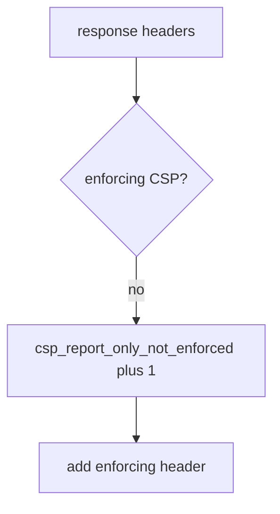

# Log that Report-Only is not enforcement, not the HTML

**Kind:** operations-exercise
**Loop step:** 6 Operate

## Fixing it once is not enough

A CDN can strip the enforcing header after deploy. Keep full HTML, note bodies, and the page source out of the ticket.

## Picture: Report-Only-only is a signal



A dashboard tile does not prove the enforcing header is present.

## Signals that do not become a second leak

| Outcome | This topic |
|---|---|
| Notice | `csp_report_only_not_enforced` |
| What the line holds | header names present; never HTML bodies |
| Recover | Flip to enforcing after encoding (6.2) |
| Leftover | XS-Leaks; cache strip; Trusted Types draft |

While the header is Report-Only, `test_report_only_is_not_enforcement` is the check. A green reporting dashboard does not turn Report-Only into enforcement. Encoding (6.2) still has to exist first — a content-security policy is a layer.

## What the framework does vs what you still have to check

CSP violation counts do not mean CI’s `isolation_enforced` requires the enforcing header. Notice must observe **Report-Only is not enforcement**, not report volume. HTML next to a Report-Only-as-enforcement reading is a logging leak (3.1). Reporting from a content-security policy is extra, later, and advanced — reports are not close.

`csp_report_only_not_enforced` fires without HTML, and a reporting dashboard is extra, not this enforcement.

## Practice

```text
log_denied reason=csp_report_only_not_enforced route=/app
```

`csp_report_only_not_enforced` already names the route. HTML, a note body, and “check-in 7 complete” are extra copies of the page.

## Use it somewhere new

Deny the HIPAA-header claim; do not paste the page source into the ticket. Do not load a live page.

## Can people still use it

A blocked-script message (once enforcing) must be readable without color-only meaning (the web accessibility baseline).

Report-Only mistaken for on opened the hole. A script that still runs is who gets hurt. Close it with the enforcing name. `csp_report_only_not_enforced` is the alert. Recover by flip-after-encoding (6.2). A green dashboard does not prove encoding exists and does not survive a CDN strip.

## What this page is not doing

A Helmet header does not turn Report-Only into enforcement. This page does not finish a check-in. The current content-security spec stays draft.
