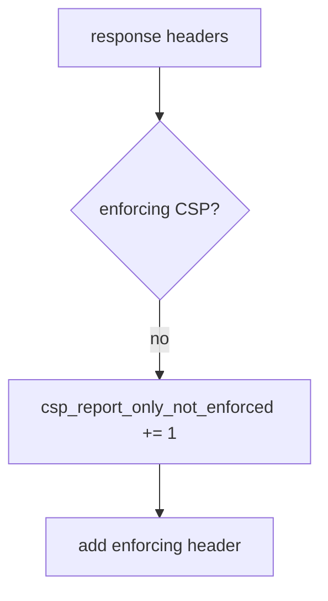

# E2-LO-06 — Detect csp_report_only_not_enforced without logging HTML

**Kind:** operations-exercise
**Loop step:** 6 Operate
**Standards:** NIST CSF 2.0 (final) DE/RS/RC as outcome labels; ASVS `v5.0.0-3.4.7` labeled **Level 3, advanced** as reporting, not close.

## Prevention is not absolute

A CDN can strip the enforcing header after deploy. Pair detect and recover. Do not log full HTML or note bodies.

## Mental model: Report-Only-only is a signal



| Outcome | This module |
|---|---|
| Detect | `csp_report_only_not_enforced` |
| Signal | header names present; never HTML bodies |
| Recover | Flip to enforcing after 6.2 |
| Residual | XS-Leaks; cache strip |

## Practice

Write one log line you would accept. Tie it to `labs/E2/e2-lab`.

```
log_denied reason=csp_report_only_not_enforced route=/app
```

Reject any line that includes HTML, a note body, or “Gate 7 complete.”

## Transfer

Clinic: deny the HIPAA-header claim; do not paste the page source into the ticket.

## Non-goals

A Helmet-vendor name is not the property. M2 stays not-attempted.
