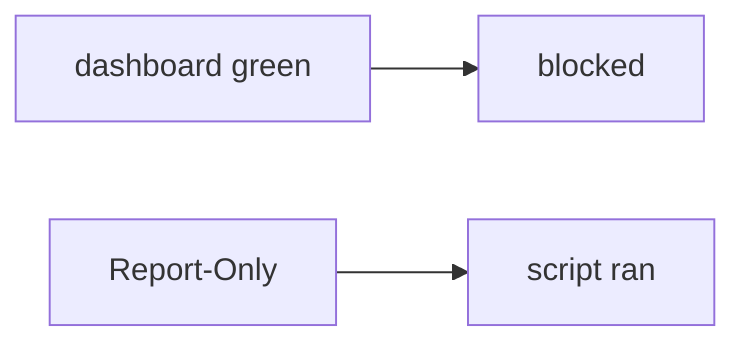

# E2-LO-07 — Transfer: clinic Report-Only as HIPAA header

**Kind:** transfer-challenge
**Loop step:** 7 Transfer
**Standards:** ASVS `v5.0.0-3.4.3`. CSP3 **draft**. `v5.0.0-3.4.7` Level 3 **advanced** as reporting.

## Change the workplace; keep a header from meaning isolation

Do not answer with a Top 10 / CWE / scanner as the definition of security. The SecureCollab sentence was: Report-Only must not make `isolation_enforced` true. Rewrite it for a clinic without changing the fork.

**Prompt:** Clinic: Report-Only as “HIPAA header.” Also name Trusted Types and COOP/COEP.

**Product sketch:** EHR-lite “we ship Content-Security-Policy-Report-Only so XSS is blocked,” plus “the reporting dashboard is green.”

Rewrite the SecureCollab sentence. Include:

1. attacker capabilities (XSS that would only be logged — not a live clinic XSS);
2. trust assumptions (enforcing header name is TCB; Report-Only/Helmet/dashboard are not);
3. forbidden outcome (`isolation_enforced` true on Report-Only, not “HIPAA”);
4. a test idea on a **local** fixture only (no live origin);
5. residual (encoding skipped, CDN strip, XS-Leaks, Trusted Types **draft**, `v5.0.0-3.4.7` Level 3);
6. WCAG if a blocked-script message is shown.

## Mental model: green report vs blocked script

If the dashboard is green while `isolation_enforced` treats Report-Only as on, the cell is gone. Helmet, a HIPAA sticker, and CSP3 do not put the enforcing name on the response. Trusted Types and COOP/COEP are sibling isolation grains — name them, do not XSS a live clinic here. CSP3 is a Working Draft; 6.2 encoding remains the first property. `v5.0.0-3.4.7` is Level 3 advanced: reporting, not enforcement.

The clinic rewrite still has to keep the SecureCollab fork: Report-Only denied, enforcing CSP may count. Adding Report-Only without the enforcing name leaves `isolation_enforced` true. The local pytest analogue is `test_report_only_is_not_enforcement` — on a fixture, not a live origin.

## What graders reject

| Reject | Why |
|---|---|
| “we have CSP” | Name may be Report-Only |
| Live XSS tutorial | Lab policy |
| “CSP3 so 6.2 is done” | Draft layer, not encoding |
| “Helmet defaults” | Library, not the name gate |
| “Gate 7 complete” | Forbidden stamp |

## Practice

One page. No keys. `labs/E2/e2-lab` is the only running system you may break. Do not XSS a live origin.

## Non-goals

Live-XSS walkthroughs. Public-origin scanning. Claiming Gate 7 or M2 from this page.
