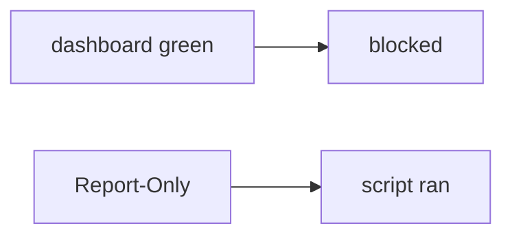

# Somewhere new: clinic Report-Only as a HIPAA header

**Kind:** transfer-challenge
**Loop step:** 7 Transfer

## Use it somewhere new

The notes-app scaffolding goes away. You get a **clinic** that ships Report-Only and calls it a “HIPAA header.” Also name Trusted Types and COOP/COEP.

Do not answer with a famous-bugs list, a CWE, or a scanner as the definition of security. The notes-app sentence was: Report-Only must not make `isolation_enforced` true. Rewrite it for a clinic without changing the fork.

**Product sketch:** an EHR-lite “we ship Content-Security-Policy-Report-Only so scripts are blocked,” plus “the reporting dashboard is green.”

## Picture: green report vs blocked script

Renaming “notes” to “charts” is not transfer. Person, object, path, and leftover change. If the dashboard is green while `isolation_enforced` treats Report-Only as on, the rule is gone. Helmet, a HIPAA sticker, and the current content-security spec do not put the enforcing name on the response. Trusted Types and COOP/COEP are sibling isolation leftovers — name them, do not load a live clinic here. The current content-security spec is still a **draft**; encoding (6.2) remains the first rule. Reporting from that policy is extra, later, and advanced: reporting, not enforcement.

| Notes app this week | Clinic sketch |
|---|---|
| Next.js response headers | EHR-lite response headers |
| Report-Only counted as isolation | Report-Only called a “HIPAA header” |
| Enforcing header name is what you trust | Same; a dashboard is not |
| Encoding leftover (6.2) | Encoding still first; Trusted Types still draft |

## Prompt — clinic Report-Only as a HIPAA header

Rewrite the notes-app sentence for this product. Your answer must include:

1. who can act (a script that would only be logged — not a live clinic script hunt);
2. what you trust (the enforcing header name is what you trust; Report-Only, Helmet, and a dashboard are not);
3. what must not happen (`isolation_enforced` true on Report-Only, not “HIPAA”);
4. a check idea on a **local** practice only (no live page);
5. leftover risk (encoding skipped, CDN strip, XS-Leaks, Trusted Types **draft**, content-security reporting as extra, later, and advanced);
6. the web accessibility baseline if a blocked-script message is shown (readable text, not color-only meaning).

The clinic rewrite still has to keep the notes-app fork: Report-Only denied, enforcing CSP may count. Adding Report-Only without the enforcing name leaves `isolation_enforced` true. The local pytest analogue is `test_report_only_is_not_enforcement` — on practice files, not a live page.

## What is not good enough

| Reject | Why |
|---|---|
| “we have CSP” | Name may be Report-Only |
| Live script hunt | Course rules |
| “The current spec so encoding is done” | Draft layer, not encoding |
| “Helmet defaults” | Library, not the name gate |
| “Check-in 7 complete” | Forbidden stamp |

## Practice

One page. No keys. `labs/E2/e2-lab` is the only running system you may break. Do not load a live page.

## What this page is not doing

Live-page walkthroughs. Public-host scanning. Claiming check-in 7 or milestone M2 from this page.
