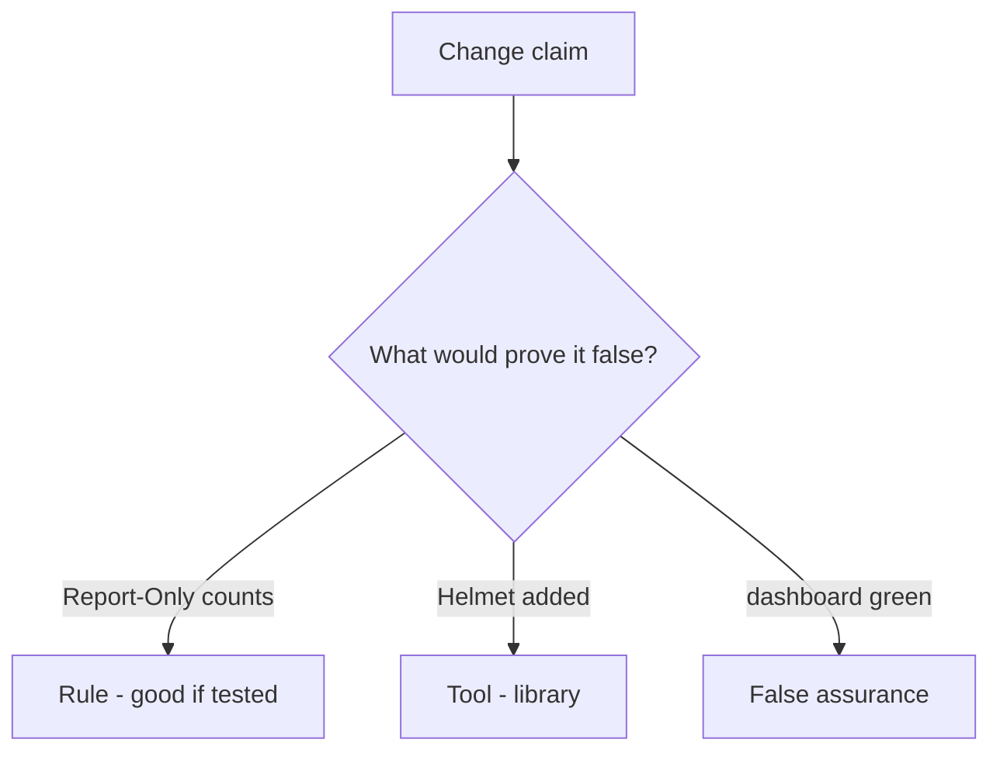

# Would you merge this Report-Only-as-on?

**Kind:** code-review
**Loop step:** Review

The answers are not on this page. Do not open the keys file until someone has looked at your review.

## What you are reviewing

A colleague ships the notes app’s header middleware. Review `labs/E2/e2-lab/vulnerable/` as that change. Don't just tally suspicious lines. Check whether Report-Only still makes `isolation_enforced` true, compare that with the rule, and write changes a developer can verify.

The check you already ran (`test_report_only_is_not_enforcement`) is the rule check. A comment “we should enforce later” is not.

## Picture: Report-Only counted as on

Look at this first: **Report-Only counted as on**. Label it **rule**, **tool**, or **false assurance** before you accept the change.

Keep this: Report-Only is not enforcement. If that call never includes the enforcing header name, that always-on leftover is still open. A dashboard screenshot does not replace that check.

Encoding is 6.2. CDN strip is 2.2. Do not skip `test_report_only_is_not_enforcement`. Do not claim check-in 7. Do not load a live page to prove the finding.

## Problems to find (name them yourself)

- Report-Only counted as on
- JSONP leftover
- Trusted Types claimed as encoding
- Edge cache stripping CSP

Also reject: a live script hunt; shipping without re-running `test_report_only_is_not_enforcement`; keys in learner notes; claiming check-in 7; presenting the current content-security spec as final.

## Common mix-ups this topic refuses

- Report-Only is isolation
- Helmet defaults are the guarantee
- A content-security policy replaces encoding
- A green reporting dashboard is encoding (6.2)
- Trusted Types is encoding

## Practice

Write three review notes a peer could act on. Each note: what you saw, rule or false assurance, suggested structural change, leftover you will **not** delete. Tie at least one note to `test_report_only_is_not_enforcement`. Do not open the keys file.

## Use it somewhere new

A clinic change that “added Report-Only and a dashboard” without an enforcing header is an incomplete isolation review. Name the independent falsehood that would still keep Report-Only from counting as on.

## What this page is not doing

Do not merge by adding a comment “will enforce later.” That comment is leftover without an owner. Do not load a public page to prove the finding.
