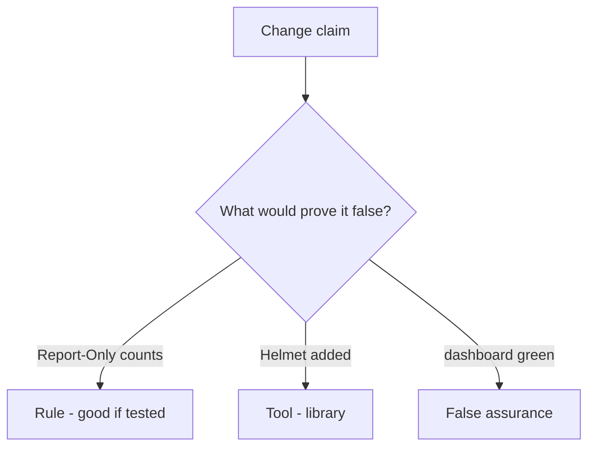

# Would you merge this Report-Only-as-on?

**Kind:** code-review
**Loop step:** Review

## What you are reviewing

Open `labs/E2/e2-lab/vulnerable/` as header middleware. Does Report-Only still make `isolation_enforced` true?

“We should enforce later” does not close `test_report_only_is_not_enforcement`.

## Picture: Report-Only counted as on

**Report-Only counted as on**.

Report-Only is not enforcement. If the change never uses the enforcing header name, that always-on leftover is still open. A dashboard screenshot does not replace that check.

Encoding is 6.2. CDN strip is 2.2. Do not claim check-in 7. Do not load a live page to prove the finding.

## Problems to find (name them yourself)

- Report-Only counted as on
- JSONP leftover
- Trusted Types claimed as encoding
- Edge cache stripping CSP

Also reject: a live script hunt; shipping without re-running `test_report_only_is_not_enforcement`; keys in learner notes; treating this CSP lesson as check-in 7; presenting the current content-security spec as final.

## Common mix-ups this topic refuses

- Report-Only is isolation
- Helmet defaults are the guarantee
- A Report-Only header is the encode check
- A green reporting dashboard is encoding (6.2)
- Trusted Types is encoding

## Use it somewhere new

Report-Only plus a dashboard, without an enforcing header, does not isolate. A green dashboard is not an enforcing header — write the Report-Only deny.

## What this page is not doing

Report-Only counted as on, plus “will enforce later,” is still a header nobody owns. Do not load a public page to prove the finding.
