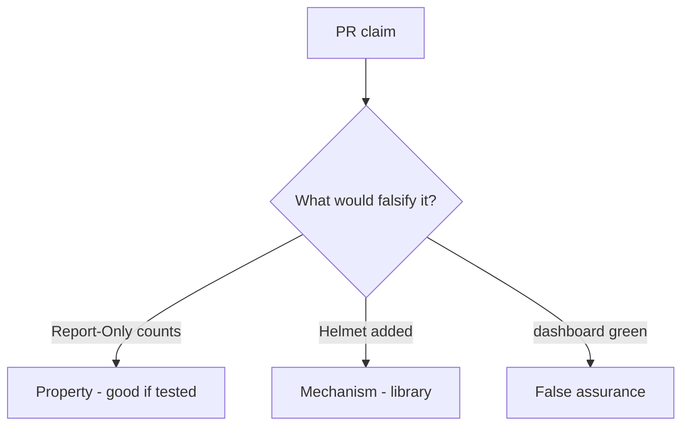

# E2-LO-08 — Review Report-Only-as-on as a PR

**Kind:** code-review
**Loop step:** Review
**Standards:** ASVS `v5.0.0-3.4.3`, `v5.0.0-3.4.7`. CSP3 **draft**.

## Review the fixture as if it were SecureCollab header middleware

Review `labs/E2/e2-lab/vulnerable/` as a SecureCollab PR. Intended findings live only in `content/assessment/keys/E2.md` — not here.

## Mental model: property, mechanism, or false assurance

Seeded smells (label them yourself; do not open the keys file):

- Report-Only counted as on
- JSONP leftover
- Trusted Types claimed as encoding
- Edge cache stripping CSP

Also reject: live XSS, keys in lessons, claiming Gate 7.

## Misconceptions

- Report-Only is isolation
- Helmet defaults are the guarantee
- CSP replaces encoding

## Practice

Write three review notes. Tie at least one to `test_report_only_is_not_enforcement`.

## Transfer

Clinic PR that “added Report-Only and a dashboard” without an enforcing header is incomplete.
