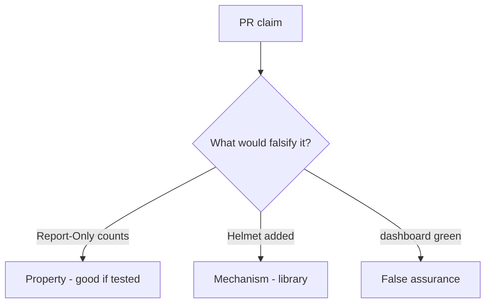

# E2-LO-08 — Review Report-Only-as-on as a PR

**Kind:** code-review
**Loop step:** Review
**Standards:** ASVS `v5.0.0-3.4.3`, `v5.0.0-3.4.7`. CSP3 **draft**.

## Review the fixture as if it were SecureCollab header middleware

Review `labs/E2/e2-lab/vulnerable/` as a SecureCollab PR. Your job is not to count suspicious lines. Reconstruct whether Report-Only still makes `isolation_enforced` true, compare that with the module invariant, and write changes a developer can verify.

Intended findings live only in `content/assessment/keys/E2.md` — not here. Do not open the keys file until your review has been evaluated.

## Mental model: Report-Only counted as on

Start with this seeded smell: **Report-Only counted as on**. Label it property, mechanism, or false assurance before you accept the PR.

Classification starts at the protected effect (Report-Only is not enforcement). Everything that is not the enforcing header name at that call is a candidate always-on path. A dashboard screenshot without that pytest is the same smell, not a different finding class.

Encoding is 6.2. CDN strip is 2.2. Do not skip `test_report_only_is_not_enforcement`. Do not claim Gate 7. Do not XSS a live origin to prove the finding.

## Seeded smells (label them yourself)

- Report-Only counted as on
- JSONP leftover
- Trusted Types claimed as encoding
- Edge cache stripping CSP

Also reject: live XSS; shipping without re-running `test_report_only_is_not_enforcement`; keys in lessons; claiming Gate 7; presenting CSP3 as final.

## Misconceptions this module refuses

- Report-Only is isolation
- Helmet defaults are the guarantee
- CSP replaces encoding
- A green reporting dashboard is 6.2
- Trusted Types is encoding

## Practice

Write three review notes a maintainer could act on. Each note: observation, property or false assurance, suggested structural change, residual you will **not** delete. Tie at least one to `test_report_only_is_not_enforcement`.

## Transfer

Clinic PR that “added Report-Only and a dashboard” without an enforcing header is an incomplete isolation review. Name the independent falsehood that would still keep Report-Only from counting as on.

## Non-goals

Do not merge by adding a comment “will enforce later.” That comment is a residual without an owner. Do not XSS a public origin to prove the finding.
