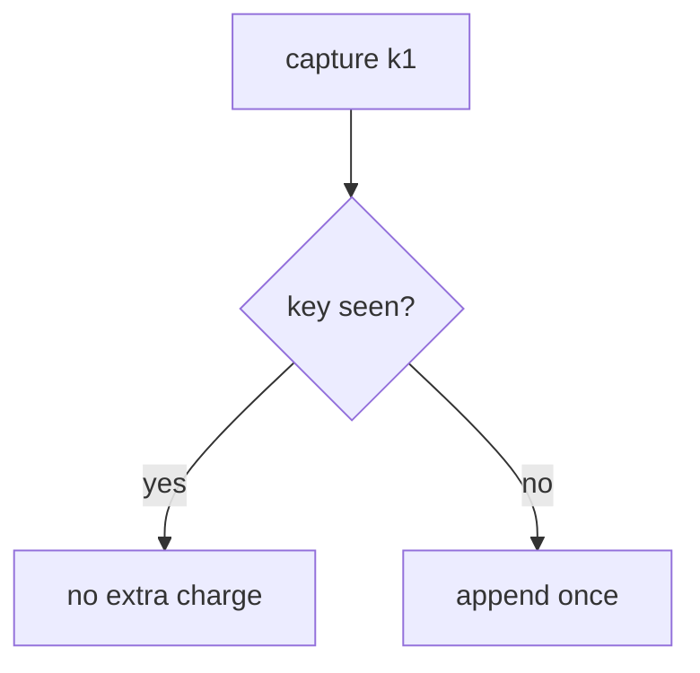

# E3-LO-01 — The same key must not double-charge

**Kind:** concept-model
**Loop step:** 1 Property
**Standards:** ASVS `v5.0.0-2.3.4`, `v5.0.0-2.3.3`; `v5.0.0-13.1.2` is **Level 3, advanced**. PCI DSS 4.0.1 is **awareness**, not this lab’s scope.

## The claim this module owns

SecureCollab does not take card payments. This elective models a **lab ledger** with synthetic amounts. **Integrity of money-like state** is whether a second `capture` with the same key is a no-op. Stripe’s idempotency header is not your table.

> Two `capture("k1")` calls must leave `charge_count() == 1`. The first capture may succeed.

The forbidden outcome is **duplicate capture double-charges**. That is 2.4 / 6.6 at money grain. No real PAN.

ASVS `v5.0.0-2.3.4` wants locking so limited resources cannot be double-booked. `v5.0.0-2.3.3` wants the operation to succeed entirely or roll back. `v5.0.0-13.1.2` (documented connection-pool limits) is **Level 3, advanced**. PCI 4.0.1 is a sector scope question — this fixture is not in PCI scope.

## Mental model: key vs append



## Mental model: processor vs ledger


**Mechanism (not the property):** Stripe, a PCI SAQ, “we are high-assurance.”

## Root cause vs impact vs prevention vs detection vs recovery

| Slice | For this property |
|---|---|
| Root cause | Non-idempotent side effect |
| Preconditions | two `capture(k1)` ⇒ count 2 |
| Trigger | Retry after 504; double-click |
| Impact | Integrity of money-like state |
| Prevention | Key as primary identity of capture |
| Detection | `duplicate_capture_denied` |
| Recovery | Credit the extra; still fail the test first |

## Framework defaults versus the ledger guarantee

A processor can be idempotent while your row still inserts twice. Accessible payment UIs that trap users cause retries (this bug).

## Mechanism limits

- Client mints a new key each retry.
- Webhook vs capture race (7.3).
- PCI SAQ is not this cell.

## Usability and accessibility

Payment confirmations must be accessible; trapped users retry (WCAG 2.2).

## Practice

Map 2.4, 7.3, 5.1 (no PAN). Then run:

```
python3 -m pytest labs/E3/e3-lab/tests --impl vulnerable
python3 -m pytest labs/E3/e3-lab/tests --impl fixed
```

The first command must fail. The second must pass.

## Transfer

Health record append-only audit. Simulated copay.

## Non-goals

Live processors, real PAN, claiming PCI or Gate 7. Answer keys are not in this file.
