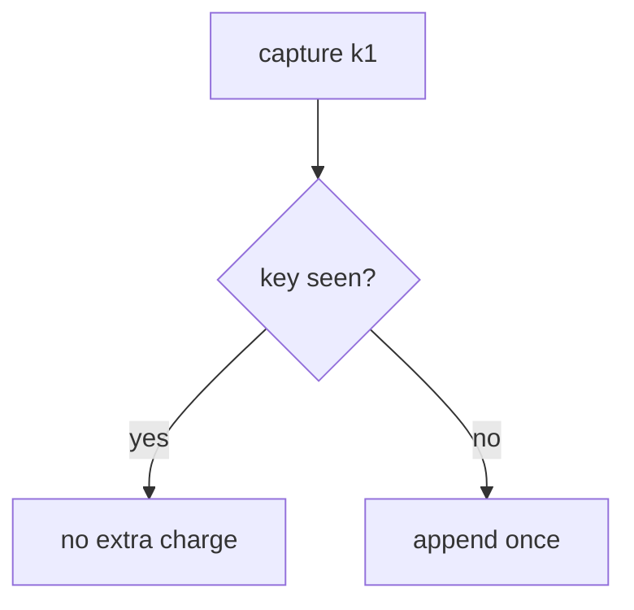
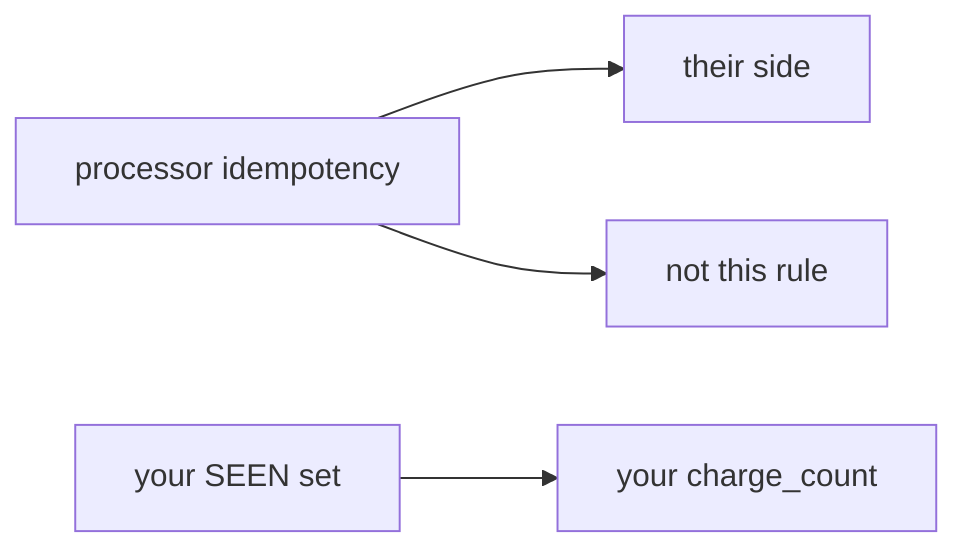

# The same key must not double-charge

**Kind:** concept-model
**Loop step:** 1 Property

## The rule

The notes app does not take card payments. This elective models a **lab ledger** with fake amounts. The check is whether money-like state stays honest: a second `capture` with the same key must not add another charge. A payment company's "please retry with this header" sticker is not your table.

> Two `capture("k1")` calls must leave `charge_count() == 1`. The first capture may succeed.

What must not happen is a **duplicate capture that double-charges**. That is the same family as a retry that grants twice (2.4) and a token spent twice (6.6), at the grain of money. No real card numbers. No real PAN.

Lock so a limited thing cannot be booked twice. The step to succeed all the way or roll back. Documented connection-pool limits are advanced leftover, not this check. A card-network questionnaire is a sector-scope question — this practice is not in that scope.

## Picture: key vs append



## Picture: processor vs ledger



A payment company's header, a filled-in questionnaire, or “we are high-assurance” is not this check.

## Why it happens, what it costs, how you stop it, how you notice, how you recover

| Slice | For this rule |
|---|---|
| Why it happens | A side effect that is not bound to the key |
| What's already wrong | two `capture(k1)` ⇒ count 2 |
| Trigger | Retry after 504; double-click |
| What it costs | Integrity of money-like state |
| How you stop it | Treat the key as the identity of the capture |
| How you notice | `duplicate_capture_denied` |
| How you recover | Credit the extra; still fail the test first |

## What the framework does vs what you still have to check

A processor can remember its own side and still leave your row inserting twice. Payment screens that trap people cause retries (this bug). Two k1, count 1.

## What the tool cannot do

- The client mints a new key each retry.
- A webhook and a capture can both append (later topic 7.3).
- A filled-in questionnaire is not this rule.

## Can people still use it

Payment confirmations must be readable and reachable; trapped people retry.

## Practice

Map retry (2.4), consume-once (6.6), and no extra copies of card-like data (5.1). Then run:

```text
python3 -m pytest labs/E3/e3-lab/tests --impl vulnerable
python3 -m pytest labs/E3/e3-lab/tests --impl fixed
```

## Use it somewhere new

Health record append-only audit. Simulated copay.

## What this page is not doing

Do not use live processors, real card numbers, claiming a questionnaire or a course gate. Answer keys are not on this site.
