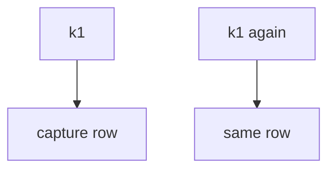
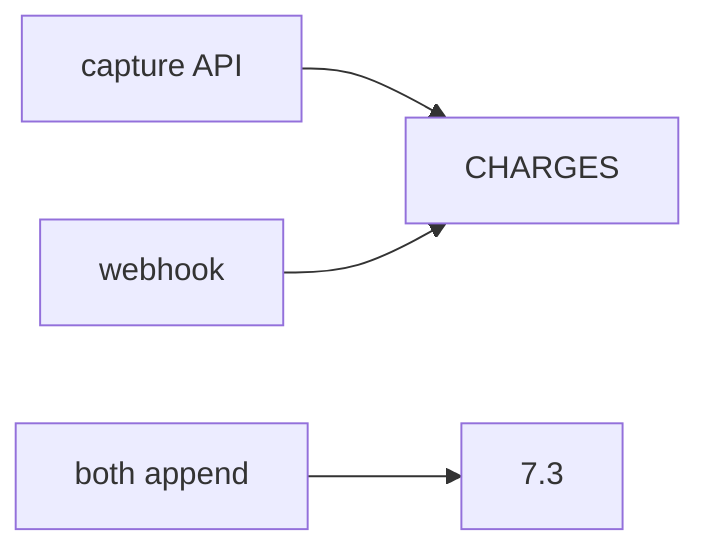

# Ledger identity vs processor sticker

**Kind:** design-exercise
**Loop step:** 2 Model

## Could someone else name the capture check from your ledger map?

A slide that says “we use Stripe idempotency” still leaves out **the key, the SEEN set, the webhook path, and that no card number is present**.

`capture(key)` is a local practice. Fake amounts only. No live processor.

## Picture: one key, one row

## Picture: two writers

If both arrows append, the map already predicts `test_duplicate_capture_does_not_double_charge` will fail.

## Step 1: name who, what, and when

| Piece | This system |
|---|---|
| Who | Retrying client; double-click |
| What | Lab ledger |
| Actions | `capture` |
| Paths | API; webhook |
| What you trust | The key as capture identity |
| What you do not trust | A processor sticker; a filled-in questionnaire |
| State / time | 504 retry |
| The rule | Integrity of money-like state |

## Step 2: write rows the lab can fail

| Who | What | Action | Decision |
|---|---|---|---|
| second k1 | charge | append | deny |
| first k1 | charge | append | may allow |
| Stripe header | local count | treat as the check | deny |
| Questionnaire | this rule | treat as proof | deny |

## Practice

The ledger helper is `pay.py` under `labs/E3/e3-lab`.

## Use it somewhere new

Health append-only: the document id is the key.

## What can still go wrong

A new key each click; webhook race; connection-pool limits are advanced leftover.

## What this page is not doing

Circling “double charge” does not stop the second `capture("k1")`. Answer keys are not on this site.
