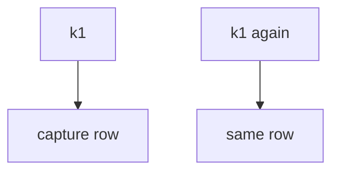
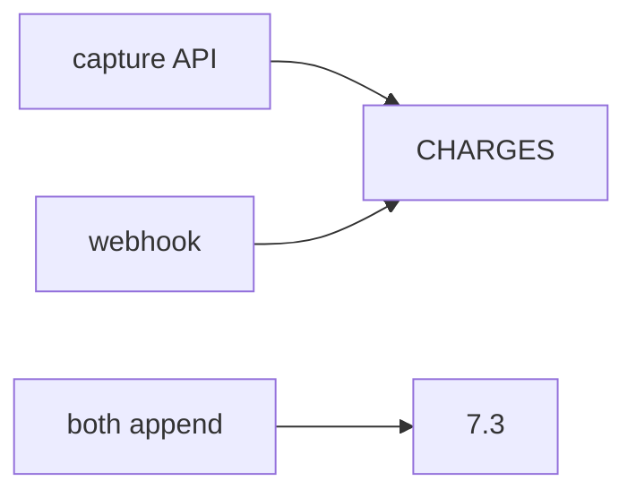

# E3-LO-02 — Ledger identity vs processor sticker

**Kind:** design-exercise
**Loop step:** 2 Model
**Standards:** ASVS `v5.0.0-2.3.4`. PCI 4.0.1 awareness not scope.

## Can a second engineer name the capture check from your ledger map?

“We use Stripe idempotency” is not this lesson. A reviewable model names **key, SEEN set, webhook path, and that PAN is absent**.

SecureCollab freeze: local `capture(key)`. Synthetic amounts.

## Mental model: one key one row

## Mental model: two writers

## Step 1: freeze pieces

| Piece | This system |
|---|---|
| Subjects | retry; double-click |
| Objects | lab ledger |
| Actions | `capture` |
| Channels | API; webhook |
| TCB | key identity |
| Untrusted | Stripe sticker; PCI SAQ |
| State / time | 504 retry |
| 1.1 cell | integrity of money-like state |

## Step 2: write cells

| Subject | Object | Action | Decision |
|---|---|---|---|
| second k1 | charge | append | deny |
| first k1 | charge | append | may allow |
| Stripe header | local count | treat as check | deny |
| PCI SAQ | this cell | treat as proof | deny |

## Practice

Draw the map. Point at `labs/E3/e3-lab` file `pay.py`.

## Transfer

Health append-only: the document id is the key.

## Residual risk

New key each click; webhook race; `v5.0.0-13.1.2` Level 3.

## Non-goals

Top 10 as the definition of security. Keys stay out of lessons.
