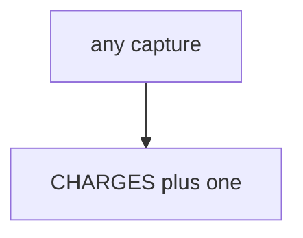

# E3-LO-03 — Observe always-append capture, do not call live processors

**Kind:** mechanism-lab
**Loop step:** 3 Break
**Standards:** ASVS `v5.0.0-2.3.4`. Lab policy: local only.

## Authorized scope

`labs/E3/e3-lab` only. Synthetic keys. Do **not** charge, refund, or scrape a real processor, clinic billing system, or public store as the exercise. No PAN.

**Forbidden outcome:** Duplicate capture double-charges the lab ledger.

## Mental model: every call appends



The vulnerable tree demonstrates **cause** (non-idempotent side effect). Do not probe public APIs.

## What to read in the fixture

`vulnerable/pay.py` appends on every `capture`. Tests require two `k1` calls to leave count 1.

## Root cause vs impact

| Slice | Lab |
|---|---|
| Root cause | Non-idempotent side effect |
| Impact | Simulated double charge |
| Not the lesson | A PCI product as the definition |

## Practice

```
python3 -m pytest labs/E3/e3-lab/tests --impl vulnerable
```

Record `test_duplicate_capture_does_not_double_charge`. Do not probe public hosts.

## Transfer

Clinic copay retry: predict without leaving this directory.

## Non-goals

No live-processor, clinic-billing, or PAN-handling instructions.
