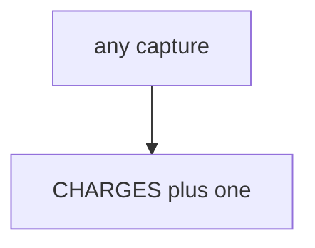

# E3-LO-03 — Observe always-append capture, do not call live processors

**Kind:** mechanism-lab
**Loop step:** 3 Break
**Standards:** OWASP ASVS 5.0.0 (final) `v5.0.0-2.3.4`. `v5.0.0-13.1.2` connection-pool limits is **Level 3, advanced**. PCI DSS 4.0.1 is **awareness**, not this lab’s scope. Lab policy: local only. No PAN.

## Authorized scope

`labs/E3/e3-lab` only. The fixture is an in-process `capture(key)` / `charge_count()`. Synthetic keys. Do **not** charge, refund, or scrape a real processor, clinic billing system, or public store as the exercise. No PAN.

**Forbidden outcome:** Duplicate capture double-charges the lab ledger. Two `capture("k1")` calls leave `charge_count() == 2`.

Attacker capability in this lab: a 504 retry or a double-click. That stands in for “Stripe idempotency is on so retries are fine,” a PCI SAQ treated as 2.4, or HTTP 200 treated as once. Trust assumption: `capture` is supposed to treat the **key as identity**. Stripe headers, FastAPI, and a SAQ PDF are not in the TCB for this cell.

## Mental model: every call appends



The vulnerable tree demonstrates **cause** (non-idempotent side effect). Do not probe public APIs. Preconditions: every `capture` appends. You do not need Stripe. You must not hit a live processor. `conftest.py` should call `reset()` so ledger state does not leak across tests.

ASVS `v5.0.0-2.3.4` wants locking so limited resources cannot be double-booked. Module 2.4 / 6.6 already said consume-once; this cell is **money-like grain**. Gate 7 and M2 stay **not-attempted**. This fixture is not in PCI scope.

## What to read in the fixture

`vulnerable/pay.py` appends on every `capture`. Tests:

- `test_duplicate_capture_does_not_double_charge`
- `test_first_capture_may_charge` — first `k1` may pass on both

You do not need a new key. The failure of `test_duplicate_capture_does_not_double_charge` *is* the evidence.

Do not open the fixed tree yet. Diagnose the cause first.

## Root cause vs impact vs prevention vs detection vs recovery

| Slice | This lab |
|---|---|
| Required property | two `capture("k1")` → charge_count 1 |
| Root cause | Non-idempotent side effect |
| Preconditions | every capture appends |
| Trigger | Retry after 504; double-click |
| Impact | Integrity of money-like state |
| Prevention | Key as primary identity; duplicate no-op |
| Detection | `duplicate_capture_denied`; never PAN-like strings |
| Recovery | Credit the extra in a runbook; still fail the test first |
| Not the lesson | A PCI product; live Stripe; Gate 7 complete |

## Framework defaults versus the ledger guarantee

A processor can be idempotent while your row still inserts twice. FastAPI will retry whatever the client repeats. Accessible payment UIs that trap users cause retries (this bug). The application guarantee is: **this** fixture, two k1 → count 1.

## Practice

```text
python3 -m pytest labs/E3/e3-lab/tests --impl vulnerable
```

Run from `labs/E3/e3-lab` if a repo-root collection picks up `site/`. Record `test_duplicate_capture_does_not_double_charge`. Do not probe public hosts. An environment error is not security evidence.

## Transfer

Clinic copay retry: predict without leaving this directory. Do not hit a live processor.

## Non-goals

No live-processor, clinic-billing, or PAN-handling instructions. Do not claim Gate 7 or PCI scope. `v5.0.0-13.1.2` stays Level 3 residual.
