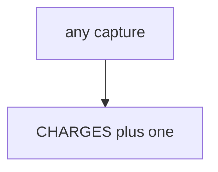

# Practice: every capture appends

**Kind:** mechanism-lab
**Loop step:** 3 Break

## Try it

The practice is not a website you attack. It is a tiny in-process `capture(key)` / `charge_count()` list. It does not open a browser, talk to a payment network, or scrape a clinic billing page. The failure is already in the object: every call appends a charge and ignores whether the key was seen. That is a **failed rule**, not a clumsy click.

> Two `capture("k1")` calls must leave `charge_count() == 1`. The first capture may succeed.

## Where you may practice

Stay inside `labs/E3/e3-lab`. Fake keys only. Restore the broken and repaired folders when you are done.

Do not charge, refund, or scrape a real processor, a clinic billing system, or a public store as the exercise. No real card numbers. No real PAN.

What must not happen: a duplicate capture double-charges the lab ledger. Two `capture("k1")` calls leave `charge_count() == 2`.

Who could do this: a **retry after 504** or a **double-click**. That stands in for “the processor said retries are fine,” a filled-in questionnaire treated as this rule, or HTTP 200 treated as once. What is supposed to stop this: `capture` treats the **key as identity**. Processor headers, FastAPI, and a questionnaire PDF are not enough.

## Picture: every call appends



The broken files show **cause** (a side effect that is not bound to the key). Do not probe public APIs. What has to be true first: every `capture` appends. You do not need a payment company. You must not hit a live processor. `conftest.py` should call `reset()` so ledger state does not leak across tests.

Topics 2.4 and 6.6 already said consume-once; this rule is **money-like grain**. This site does not mark you as finished. This practice is not in card-network scope.

## What to look at: the cause, not a trophy

Read `vulnerable/pay.py`. `capture` appends on every call. Checks:

- `test_duplicate_capture_does_not_double_charge`
- `test_first_capture_may_charge` — first `k1` may pass on both

You do not need a new key.
## Why it happens, what it costs, how you stop it, how you notice, how you recover

| Slice | This practice |
|---|---|
| The rule | two `capture("k1")` → charge_count 1 |
| Why it happens | A side effect that is not bound to the key |
| What has to be true first | every capture appends |
| Trigger | Retry after 504; double-click |
| What it costs | Integrity of money-like state |
| How you stop it | Treat the key as identity; a duplicate is a no-op |
| How you notice | `duplicate_capture_denied`; never card-number-like strings |
| How you recover | Credit the extra in a runbook; still fail the test first |
| Not the lesson | A questionnaire product; live Stripe; a course gate complete |

## What the framework does vs what you still have to check

A processor can remember its own side and still leave your row inserting twice. FastAPI will retry whatever the client repeats. Payment screens that trap people cause retries (this bug). What this practice is supposed to show: two k1 → count 1.

## Practice

```text
python3 -m pytest labs/E3/e3-lab/tests --impl vulnerable
```

Run from `labs/E3/e3-lab` if a run at the repo root picks up `site/`. Do not probe public hosts. A setup error is not proof the rule holds.

## Use it somewhere new

Clinic copay retry: predict without leaving this directory. Do not hit a live processor.

## What this page is not doing

No live-processor, clinic-billing, or card-handling instructions. Do not claim a course gate or card-network scope. Connection-pool limits stay advanced leftover.
