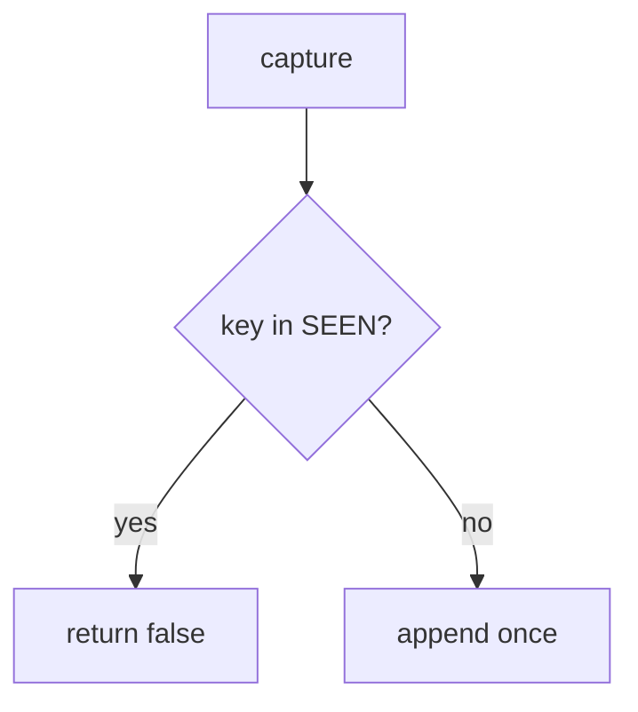

# E3-LO-04 — Treat the key as capture identity

**Kind:** design-exercise
**Loop step:** 4 Build
**Standards:** ASVS 5.0.0 (final) `v5.0.0-2.3.4`, `v5.0.0-2.3.3`. `v5.0.0-13.1.2` is **Level 3, advanced**. PCI 4.0.1 is awareness, not scope.

## Structural means the second key is a no-op

`capture` must add to `SEEN` and `CHARGES` only when the key is new. Fail-safe: duplicate denies extra charge. A processor header may *accompany* a match; it does not replace your set. Structural means that identity — not Stripe, not a SAQ, not HTTP 200.

The smallest restore for the lab ledger is: two k1 → count 1, first k1 may charge. Do not fail open because the processor said ok. Do not mint a new key on every retry and call that idempotency.

## Mental model: seen gate



Do not accept “Stripe was sent the header” as membership. Production still needs the webhook path to use the same key — a second insert from a webhook is a lying once. Clients that mint a new key each click bypass this pytest. `v5.0.0-2.3.3` wants the operation to succeed entirely or roll back. `v5.0.0-13.1.2` (connection-pool limits) is Level 3 advanced.

ASVS `v5.0.0-2.3.4` wants no double-booking. This pytest is that sentence for two k1.

## Why this restores the cell

| After the fix | Must be true |
|---|---|
| two k1 | count 1 |
| first k1 | capture true |

## What this is not

PCI SAQ. Stripe. Gate 7. New-key retries (residual). Health-record append-only as a different product (same grain).

## Mechanism limits

- Client mints a new key each retry.
- Webhook path can still append if it ignores SEEN.
- `v5.0.0-13.1.2` Level 3 pool limits are not this predicate.
- Accessible UIs that trap users cause retries — WCAG residual.
- This lab has no PAN and is not PCI scope.

## Practice

Name who can mint keys. Run:

```text
python3 -m pytest labs/E3/e3-lab/tests --impl fixed
```

Must pass. Run from the lab directory if collection at repo root is polluted.

## Transfer

Health: the document version id is the key, not “POST again.”

## Residual risk

Webhook race; new key each click; `v5.0.0-13.1.2` Level 3.

## Non-goals

Do not hit a live processor. Do not claim PCI from this lab. Do not invent PAN.
