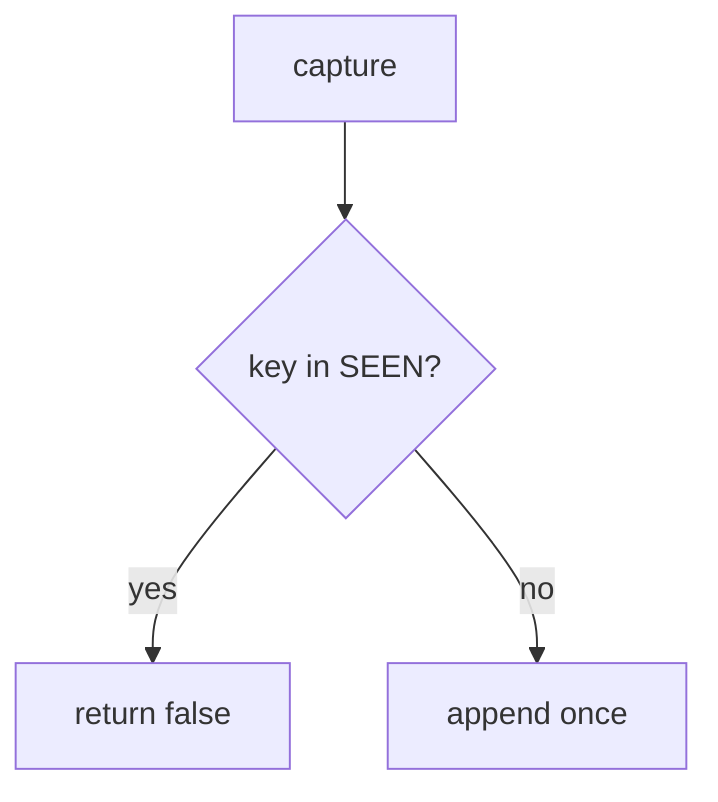

# Treat the key as capture identity

**Kind:** design-exercise
**Loop step:** 4 Build

## The rule

`capture` must add to `SEEN` and `CHARGES` only when the key is new. Fail-safe: a duplicate denies the extra charge. A processor header may *ride along* with a match; it does not replace your set. Structural means that identity — not a payment company, not a questionnaire, not HTTP 200.

Put this in the notes app's lab ledger: two k1 → count 1, first k1 may charge. Do not allow just because the processor said ok. Do not mint a new key on every retry and call that remembering.

## Picture: seen gate



Do not accept “we sent the processor the header” as membership. The webhook path still has to use the same key — a second insert from a webhook is a lying once. Clients that mint a new key each click walk around this check. The step to succeed all the way or roll back. Connection-pool limits are advanced leftover.

There should also be no double-booking — two k1.

## What the repaired files must show

| After the fix | Must be true |
|---|---|
| two k1 | count 1 |
| first k1 | capture true |

## What this is not

A filled-in questionnaire. A payment company. A course gate. New-key retries (leftover). Health-record append-only as a different product (same grain).

## What can still go wrong

- The client mints a new key each retry.
- The webhook path can still append if it ignores SEEN.
- Connection-pool limits are not this check.
- Screens that trap people cause retries — leftover for people who still need to use it.
- This practice has no card numbers and is not in card-network scope.

## Practice

Name who can mint keys. Run:

```text
python3 -m pytest labs/E3/e3-lab/tests --impl fixed
```

Run from the practice folder if a run at the repo root is polluted.

## Use it somewhere new

Health: the document version id is the key, not “POST again.”

## What this page is not doing

Do not hit a live processor. Do not claim card-network scope from this practice. Do not invent card numbers.
