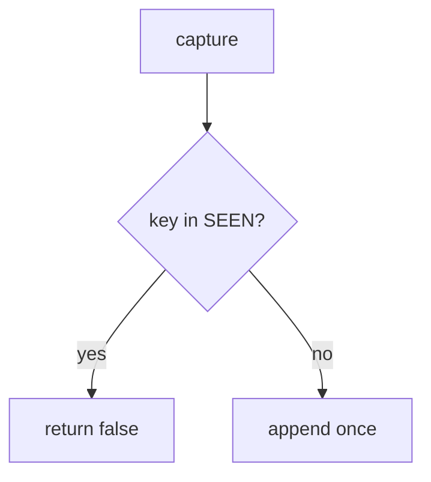

# E3-LO-04 — Treat the key as capture identity

**Kind:** design-exercise
**Loop step:** 4 Build
**Standards:** ASVS 5.0.0 (final) `v5.0.0-2.3.4`, `v5.0.0-2.3.3`.

## Structural means the second key is a no-op

`capture` must add to `SEEN` and `CHARGES` only when the key is new. Fail-safe: duplicate denies extra charge. A processor header may *accompany* a match; it does not replace your set.

## Mental model: seen gate



Do not accept “Stripe was sent the header” as membership.

## Why this restores the cell

| After the fix | Must be true |
|---|---|
| two k1 | count 1 |
| first k1 | capture true |

## What this is not

PCI SAQ. Stripe. Gate 7. New-key retries (residual).

## Practice

Name who can mint keys. Run:

```
python3 -m pytest labs/E3/e3-lab/tests --impl fixed
```

Must pass.

## Transfer

Health: the document version id is the key, not “POST again.”

## Residual risk

Webhook race; new key each click; `v5.0.0-13.1.2` Level 3.
