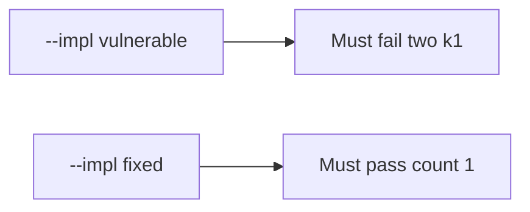

# E3-LO-05 — Evidence is duplicate denied, then a passing pair

**Kind:** verification-lab
**Loop step:** 5 Verify
**Standards:** ASVS `v5.0.0-2.3.4`.

## An invariant that cannot fail a test is still a slogan

“We use Stripe” is not evidence. The oracle is the local pair. Do not hit live processors.

## Mental model: fail-on-vulnerable, pass-on-fixed



| Case | Must show |
|---|---|
| Negative / abuse | two k1 → count 1 |
| Normal | first k1 → may charge |
| Not claimed | live Stripe; PCI; Gate 7 |

```
python3 -m pytest labs/E3/e3-lab/tests --impl vulnerable
python3 -m pytest labs/E3/e3-lab/tests --impl fixed
```

Honest first capture may pass on both.

## What the tests do not prove

- Webhook path is idempotent
- Client cannot mint a new key
- Connection-pool limits (`v5.0.0-13.1.2` Level 3)

## Practice

Execute both implementations. Map each test to an LO-02 cell.

## Transfer

Clinic: a test that only asserts “Stripe returned 200” is not this cell.
