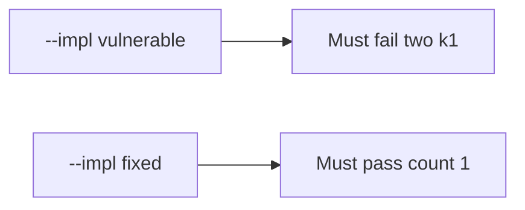

# E3-LO-05 — Evidence is duplicate denied, then a passing pair

**Kind:** verification-lab
**Loop step:** 5 Verify
**Standards:** ASVS `v5.0.0-2.3.4`. PCI 4.0.1 awareness, not the oracle.

## An invariant that cannot fail a test is still a slogan

“We use Stripe” is not evidence. “PCI SAQ is filed” is a mechanism observation. The oracle is: two `capture("k1")` leave count 1 and the first capture may succeed. The two-k1 observation must be **false** on `--impl vulnerable` (count 2) and **true** on `--impl fixed`. Do not hit live processors.

## Mental model: vulnerable must fail: two k1

The failing observation on `--impl vulnerable` is **two k1**. A passing collection count is not this cell.



| Mode | Must show for this module |
|---|---|
| Negative / abuse | two k1 → count 1; vulnerable must fail |
| Normal | first k1 → may charge (may pass on both) |
| Not claimed | live Stripe; PCI; Gate 7; webhook path |

Lab tests in `labs/E3/e3-lab/tests/test_property.py`. `test_duplicate_capture_does_not_double_charge` is a **forbidden-outcome** test: always-append `capture` is not allowed to count as a passing control. `reset()` keeps ledger state from leaking.

```text
python3 -m pytest labs/E3/e3-lab/tests --impl vulnerable
python3 -m pytest labs/E3/e3-lab/tests --impl fixed
```

Honest first capture may pass on both implementations. That does not excuse the two-k1 deny test. If vulnerable does not fail `test_duplicate_capture_does_not_double_charge`, the lab is miswired—fix the wiring, not the assertion.

## What the tests do not prove

- Webhook path is idempotent
- Client cannot mint a new key
- Connection-pool limits (`v5.0.0-13.1.2` Level 3)
- PCI scope
- Gate 7 / M2 complete

Record those as residuals or later modules, not as silent passes.

## Practice

Execute both implementations this session from the lab directory if needed. Write the fail/pass pair next to the matrix row. Reject a “test” that only greps `Idempotency-Key` in a Stripe client without calling `capture("k1")` twice.

## Transfer

Clinic: a test that only asserts “Stripe returned 200” is not this cell. A live processor is out of scope.

## Non-goals

Do not add a live-processor trophy. Do not log PAN-like strings. Keys stay out of this file. Gate 7 stays not-attempted.
