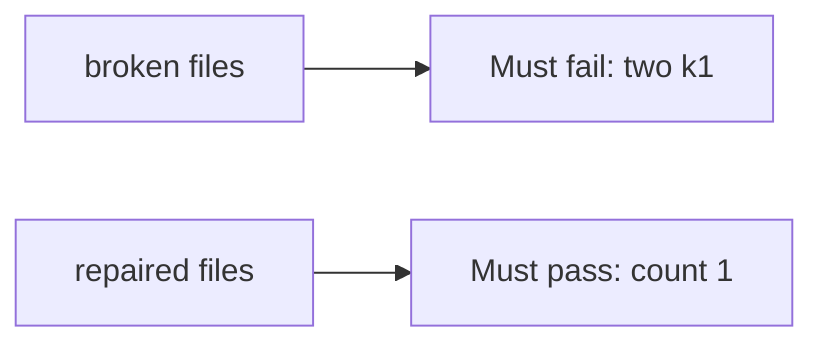

# Charging twice with the same key must fail

**Kind:** verification-lab
**Loop step:** 5 Verify

## Check it

“We use Stripe” is not evidence. “The questionnaire is filed” is a tool observation. The check is: two `capture("k1")` leave count 1 and the first capture may succeed. That two-k1 observation must be **false** on `--impl vulnerable` (count 2) and **true** on `--impl fixed`. Do not hit live processors.

## Picture: a second k1 that charges twice must fail

A grep for a processor header can still hide that every capture still appends.



| Mode | Must show for this topic |
|---|---|
| Wrong input / abuse | two k1 → count 1; broken files must fail |
| Normal | first k1 → may charge (may pass on both) |
| Not claimed | live Stripe; card-network scope; a course gate; webhook path |

The checks are in `labs/E3/e3-lab/tests/test_property.py`. `test_duplicate_capture_does_not_double_charge` is there so always-append `capture` still fails. `reset()` keeps ledger state from leaking.

```text
python3 -m pytest labs/E3/e3-lab/tests --impl vulnerable
python3 -m pytest labs/E3/e3-lab/tests --impl fixed
```

Honest first capture may pass on both implementations. That does not excuse the two-k1 deny test. If the broken files do not fail `test_duplicate_capture_does_not_double_charge`, the lab is miswired — fix the wiring, not the check.

## What the tests do not prove

- The webhook path remembers
- The client cannot mint a new key
- Connection-pool limits (advanced leftover)
- Card-network scope
- A course gate complete

## Practice

Do not treat a grep for `Idempotency-Key` in a Stripe client as the check. Call `capture("k1")` twice.

## Use it somewhere new

Asserting “the processor returned 200” is not this check. Do not use a live processor.

## What this page is not doing

Do not treat a live processor screenshot as proof. Do not log card-number-like strings. Answer keys are not on this site. This site does not mark you as finished.
