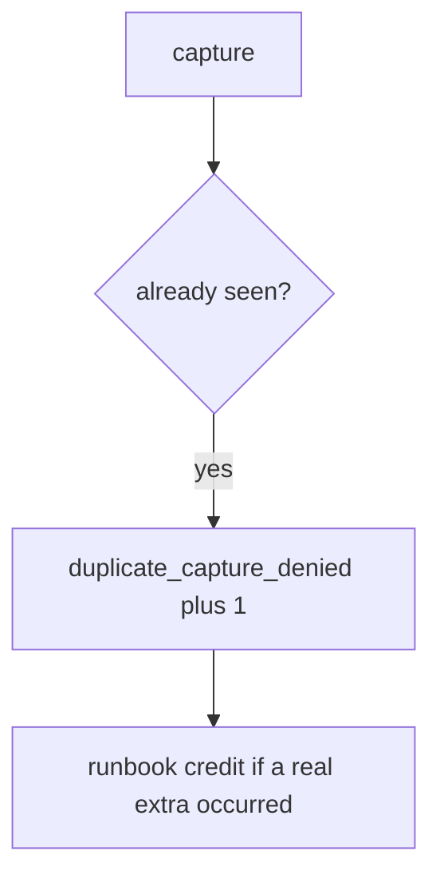

# Log the duplicate capture, not the card number

**Kind:** operations-exercise
**Loop step:** 6 Operate

## Stopping it is not enough

A webhook can still append. Pair notice and recover. There is no card number in this practice — keep it that way (5.1). Do not paste billing dumps into the ticket.

## Picture: second k1 is a signal



| Outcome | This topic |
|---|---|
| Notice | `duplicate_capture_denied` |
| What the line holds | key id; never card-number-like strings |
| Recover | Credit extra in a runbook; still fail the test first |
| Leftover | New-key retry; webhook race |

Industry lists talk about noticing, responding, and recovering. They do not prove this ledger rule. Naming a product is not the rule. Re-run `test_duplicate_capture_does_not_double_charge` after any capture-path change; a green “processor remembers” tile is not that check. Webhook inserts are the same family — inventory them before claiming recover.

## What the framework does vs what you still have to check

A processor dashboard will show successful captures and stay silent when CI’s `capture` always appends. Notice must observe **two k1 → count 1**, not processor 200s. If the alert includes a card number, you have opened a leftover hole from topic 5.1 this elective forbids.

## Practice

Write one log line you would accept. Tie it to `labs/E3/e3-lab`.

```text
log_denied reason=duplicate_capture_denied key=k1
```

Reject any line that includes a card number, a note body, or “questionnaire complete.”

## Use it somewhere new

A clinic example: deny the second copay; do not paste billing dumps into the ticket. Do not hit a live processor.

## Can people still use it

A duplicate deny must say *key already captured*, not only “assert False.” Confirmations that trap people into retry are leftover that *causes* this bug.

Cause vs cost stays split here too: the **cause** is an append that is not bound to the key; the **cost** is a double charge on the lab ledger; **how you stop it** is the seen gate; **how you notice** is `duplicate_capture_denied`; **how you recover** is runbook credit after the test fails. What the tool cannot do: this alert does not stop a new key per click and does not serialize webhooks.

## What this page is not doing

A payment-vendor name is not the rule. Course milestones stay unclaimed. A filled-in questionnaire is not this alert.
