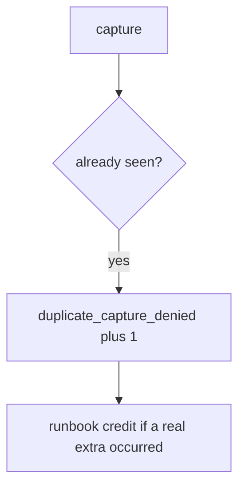

# Log the duplicate capture, not the card number

**Kind:** operations-exercise
**Loop step:** 6 Operate

## Fixing it once is not enough

A webhook can still append. There is no card number in this practice — keep it that way (5.1). Do not paste billing dumps into the ticket.

## Picture: second k1 is a signal



| Outcome | This topic |
|---|---|
| Notice | `duplicate_capture_denied` |
| What the line holds | key id; never card-number-like strings |
| Recover | Credit extra in a runbook; still fail the test first |
| Leftover | New-key retry; webhook race |

A second `k1` still has to fail `test_duplicate_capture_does_not_double_charge`. The processor name does not remember captures for you. Webhook inserts can still double-charge; the ledger is not once until that path is named.

## What the framework does vs what you still have to check

A processor dashboard will show successful captures and stay silent when CI’s `capture` always appends. Notice must observe **two k1 → count 1**, not processor 200s. If the alert includes a card number, you have opened a leftover hole from topic 5.1 this elective forbids.

## Practice

```text
log_denied reason=duplicate_capture_denied key=k1
```

A card number, a note body, or “questionnaire complete” would reprint PAN-like data in the log.

## Use it somewhere new

Deny the second copay; do not paste billing dumps into the ticket. Do not hit a live processor.

## Can people still use it

A duplicate deny must say *key already captured*, not only “assert False.” Confirmations that trap people into retry are leftover that *causes* this bug.

An append that is not bound to the key — that's why. A double charge on the lab ledger is the harm. Repair is the seen gate. Notice is `duplicate_capture_denied`. Recovery is runbook credit after the test fails. The metric does not stop a new key per click and does not serialize webhooks.

## What this page is not doing

A processor dashboard does not make capture once. This page does not finish a check-in. A filled-in questionnaire does not lock the ledger.
