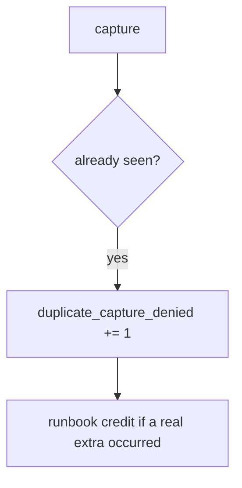

# E3-LO-06 — Detect duplicate_capture_denied without logging PAN

**Kind:** operations-exercise
**Loop step:** 6 Operate
**Standards:** NIST CSF 2.0 (final) DE/RS/RC as outcome labels; ASVS `v5.0.0-2.3.4`.

## Prevention is not absolute

A webhook can still append. Pair detect and recover. There is no PAN in this lab — keep it that way (5.1).

## Mental model: second k1 is a signal



| Outcome | This module |
|---|---|
| Detect | `duplicate_capture_denied` |
| Signal | key id; never PAN-like strings |
| Recover | Credit extra in a runbook; still fail the test first |
| Residual | New-key retry; webhook race |

## Practice

Write one log line you would accept. Tie it to `labs/E3/e3-lab`.

```
log_denied reason=duplicate_capture_denied key=k1
```

Reject any line that includes a card number, a note body, or “PCI complete.”

## Transfer

Clinic: deny the second copay; do not paste billing dumps into the ticket.

## Non-goals

A Stripe-vendor name is not the property. M2 stays not-attempted.
