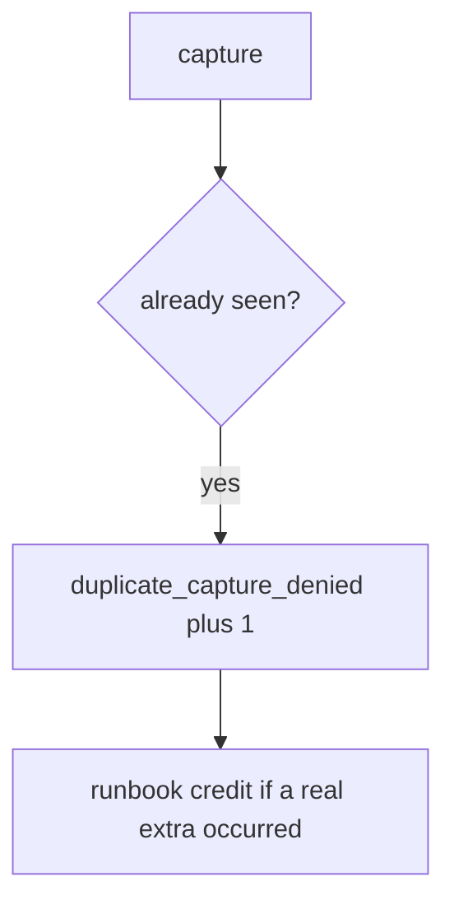

# E3-LO-06 — Detect duplicate_capture_denied without logging PAN

**Kind:** operations-exercise
**Loop step:** 6 Operate
**Standards:** NIST CSF 2.0 (final) DE/RS/RC as outcome labels; ASVS `v5.0.0-2.3.4`.

## Prevention is not absolute

A webhook can still append. Pair detect and recover. There is no PAN in this lab — keep it that way (5.1). Do not paste billing dumps into the ticket.

## Mental model: second k1 is a signal



| Outcome | This module |
|---|---|
| Detect | `duplicate_capture_denied` |
| Signal | key id; never PAN-like strings |
| Recover | Credit extra in a runbook; still fail the test first |
| Residual | New-key retry; webhook race |

CSF 2.0 Detect / Respond / Recover name outcomes. They do not prove `v5.0.0-2.3.4`. A Stripe-product name is not the property. Re-run `test_duplicate_capture_does_not_double_charge` after any capture-path change; a green “processor idempotent” tile is not that pytest. Webhook inserts are the same family — inventory them before claiming Recover.

## Framework defaults versus the operate guarantee

A processor dashboard will show successful captures and stay silent when CI’s `capture` always appends. Detection must observe **two k1 → count 1**, not Stripe 200s. If the alert includes a card number, you have opened a 5.1 cell this elective forbids.

## Practice

Write one log line you would accept. Tie it to `labs/E3/e3-lab`.

```text
log_denied reason=duplicate_capture_denied key=k1
```

Reject any line that includes a card number, a note body, or “PCI complete.”

## Transfer

Clinic: deny the second copay; do not paste billing dumps into the ticket. Do not hit a live processor.

## Usability

A duplicate deny must say *key already captured*, not only “assert False” (WCAG 2.2 Success Criterion 4.1.3). Confirmations that trap users into retry are a WCAG residual that *causes* this bug.

Cause vs impact stays split here too: the **cause** is non-idempotent append; the **impact** is a double charge on the lab ledger; **prevention** is the seen gate; **detection** is `duplicate_capture_denied`; **recovery** is runbook credit after the test fails. Mechanism limit: this alert does not stop a new key per click and does not serialize webhooks.

## Non-goals

A Stripe-vendor name is not the property. M2 stays not-attempted. PCI SAQ is not this alert.
