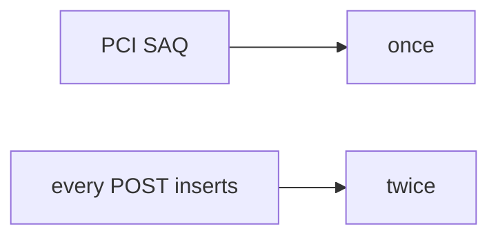

# Same idea on a health append-only audit

**Kind:** transfer-challenge
**Loop step:** 7 Transfer

## Use it somewhere new

You get a **health-record append-only audit**, plus a **simulated copay**. On the notes app, two `capture("k1")` must leave count 1. A processor sticker must not mean the ledger is once.

**Prompt:** Health record append-only audit. Also name a simulated copay.

**Product sketch:** EHR-lite “the processor said retries are fine,” plus “we filed a questionnaire so high-assurance is done.”

1. who can act (504 retry / double-click — not a live clinic processor attack);
2. what you trust (key identity is what you trust; a payment company and a questionnaire are not);
3. what must not happen (two `k1` → count 2, not a privacy-law name);
4. a test idea on a **local** practice only (no live Stripe);
5. leftover (new key each click, webhook race, connection-pool limits as advanced leftover);
6. whether confirmations trap people into retry.

## Picture: questionnaire vs once

If the questionnaire is filed while `capture` always appends, the rule is gone. Processor headers and a card-network standard do not put `k1` in `SEEN`. A health append-only audit is the same grain: the document version id is the key, not “POST again.” Name it, do not hit a live processor here. This practice is not in card-network scope. Connection-pool limits are advanced leftover: pool size, not this check.

Two k1 still have to count as 1. The first k1 may still charge. Adding a payment company without a local seen-set leaves count 2. The local check is `test_duplicate_capture_does_not_double_charge` — on a practice, not a live processor.

## What is not good enough

| Reject | Why |
|---|---|
| “we have Stripe” | Their side, not your count |
| Live processor / card-number tutorial | Course rules |
| “questionnaire so this rule is done” | Awareness / scope, not this rule |
| “HTTP 200” | Event, not once |
| “course gate complete” | Forbidden stamp |

## Practice

One page. No keys. `labs/E3/e3-lab` is the only running system you may break. Do not hit a live processor. No real card numbers. No real PAN.

## What this page is not doing

Do not run live-processor attacks. Do not use real card data. This page does not finish a check-in, a milestone, or card-network scope.
